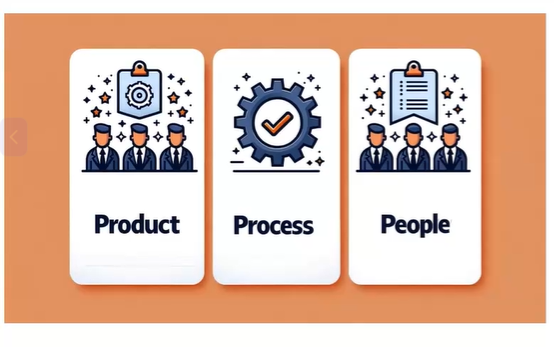
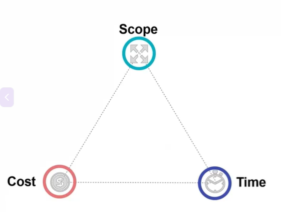
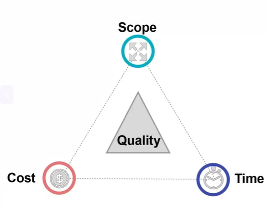
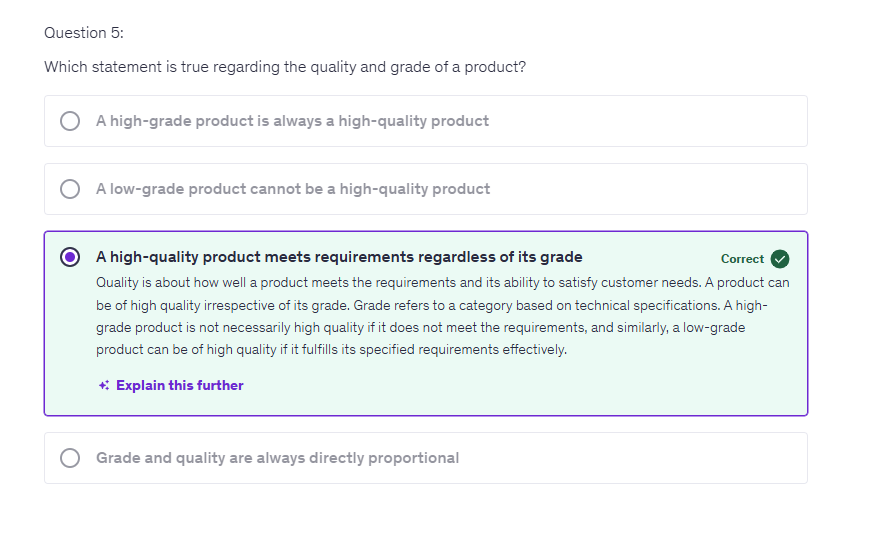

# Introduction

## What is a Project?

* Definition - A project is a **temporary** endeavour undertaken to create a **unique** product, service, or result. It has a **definite start and end.**

* Key Characteristics
  * **Temporary** - Projects are not ongoing efforts and have a clear end point
  * **Unique** - Each project has a distinct objective, set of resources, and plan
  * **Phases of a Project** : Initiating, Planning, Executing, Monitoring and Controlling, Closing
  * **Example** - Creating a new software application involves defining requirements, designing, coding, testing, and rollout, with each phase requiring its own quality criteria

Example - 

```txt
When I'm talking about my own experience. My own experience is in construction projects. For example, building a
skyscraper, building a refinery, building a chemical plant, or maybe
building a house, or maybe rebuilding your bathroom.
Those are the construction projects.
```

```txt
It could be a marketing campaign. So you have a definite objective in
your mind. You have a definite budget, you have definite number of
people working on this, a definite starting and ending point and
making sure that the marketing campaign achieves the objective
which has been set for it. That is a project.
```

```txt
Then we have event planning. So let's say if you are planning a big
event where number of people are coming, that itself is a project.
Or maybe forget about a big event when you are inviting 5 families
to your house for a dinner party, that also is a project and then.

Another example of the project could be a research project, 
let us say.
When Covid came in, the research team went together with a
definite objective. They wanted to find out a vaccine for that. That
was an objective, for that there were limited resources to execute
that project.
There was not exactly an end date, predefined end date, but yeah
there was an attempt to do that as fast as possible, but then once
that medicine or vaccine has been developed, that project has
ended. So these are some of the examples of project.
```

## Definition of Quality


```txt
But before I talk about quality let's talk about grade.

There is a difference between quality and grade.

And we need to be clear about that when it comes to the project quality.

Now what is great if you compare to pen one pen, which is let's say a $1 pen or maybe $0.50 pen. That writes good.

There is no problem when you write with that pen.

And then on the other hand, there are very high end pens, a pen which could cost you $1,000, $2,000, that also writes well.

Now, what would you say?
Which pen is a better quality pen?

Here we need to understand that these two are different grades, different type of things.

You cannot compare a 50 cent pen and a $1,000 pen because these are of two different grades.

Same thing applies to the project also.

So when you execute a project, you have to define that what level of things, what grade you are interested in and meeting those requirements would be quality.

So having a clear distinction between grade and quality is important when it comes to the project quality management.
```

```txt
Now in the context of a project, what is quality?

Quality is referred to the degree to which the project's deliverable.

Now the project deliverable could be, let's say, a refinery, a house which you are building, or an app which you are making, or the event which you are executing.

That's the deliverable of that project.

As long as the deliverable meets the stakeholders defined and the implied needs and expectations, that means it is a quality project.

So you need to define that.

What are the needs and expectations of the stakeholders.

And if the project meets those things, those stakeholder needs and expectations then it is a quality project.
```
> As long as the deliverable(an app or a refinery or a house) meets the stakeholders defined and the implied needs and expectations, that means it is a quality project.
> So you need to define that. What are the needs and expectations of the stakeholders.


* Process

```txt
Now another thing is that quality is not just the end product.

The quality is not defined just by the end product.

It is defined by the processes which are used to achieve that.

Because if your processes are stable, if your processes are good, there is a very good chance that

you will meet the expectations of your stakeholders.

But if your processes are not proper, if your processes are not well defined, everyone is doing things of its own.

Remember project is not done by one person.

The project is done by multiple people working together.

So you need to have a set of processes and procedures to execute the project.

So this is another thing which you need to think, not just the output.

Think of the processes as well a part of quality.
```

## Dimensions of Quality

Below are 3 broad dimensions of quality - 

* Project quality can be broken down into three primary dimensions: Product quality, Process quality, and People quality.

* **Product Quality**: The final deliverable should meet or
exceed stakeholder expectations.

* **Process Quality**: The methods used to deliver the product should be efficient and effective.

* **People Quality:** The team's skills, morale, and collaboration are crucial for achieving high-quality results.

NOTE: This is not in PMP BoK. My own experience and way of understanding quality



> Now let's look at some more dimensions of quality.
> When we say quality.
> What does that mean?

**Quality in project management is multi-dimensional and encompasses various
aspects that collectively contribute to project success.**

1. **Performance**: Ensuring the project deliverable functions as intended.  
Example: A software application should meet all its functional requirements without
glitches.

2. **Conformity**: Ensuring the project deliverable is fit for use and meets all the
specifications.  
Example: A construction project should adhere to safety and building codes.

3. **Reliability**: Ensuring the project deliverable produces consistent results.  
Example: A customer support process should offer the same high-quality of service
at all times.

4. **Resilience**: The ability of the project deliverable to recover quickly from
unforeseen failures.  
Example: A network system that can recover quickly from outages.

5. **Satisfaction**: The project deliverable should meet or exceed user
expectations, including usability and user experience.  
Example: A user-friendly interface that makes navigating a new software tool
easy for users.

6. **Uniformity**: Ensuring parity among deliverables produced in the
same manner.  
Example: All units of a manufactured item should have the same features and
quality.
> Consistent result

7. **Efficiency**: Deliverables should be produced with the least amount
of resources and effort.  
Example: Streamlining operations to reduce costs while maintaining quality.  
> Save money

8. **Sustainability**: The project deliverable should positively impact
economic, social, and environmental aspects.  
Example: Using sustainable materials in a construction project.  
> e.g. green energy

```txt
So these are eight dimensions of quality defined in the seventh edition of PMBoK guide.
If you have heard about Garvin's eight Dimensions of quality, there is some overlap between these.
But then that adds some additional feature or additional dimensions to quality.
```

## Quality and the Triple Constant

* **Why Quality Matters?**

* A commitment to quality ensures that **projects meet
stakeholder expectations and often exceed them.**
* Quality affects not just customer satisfaction but also
impacts project costs, scope, and timing.
* Prioritizing quality leads to fewer reworks, higher
productivity, and a stronger reputation for your
organization.
* Quality is integral to the Triple Constraint of Time, Cost,
and Scope.

* The Triple Constraint refers to the interconnected
relationship between **Time, Cost, and Scope**, the three key
parameters defining any project.
  * Quality and Time: Timely delivery of project milestones and the final
product are indicators of quality. Delays can affect stakeholder
satisfaction and overall project quality.
  * Quality and Cost: Meeting the budget while delivering a high-quality
product demonstrates effective cost management. Overruns often
lead to cutting corners, negatively impacting quality.
  * Quality and Scope: Delivering all the agreed-upon features and
functionalities within the planned time and budget signifies high
project quality. Scope changes must be managed to avoid
compromising quality.

* Integrated View: Quality is not an isolated component but
is intrinsically tied to Time, Cost, and Scope. Success in
these areas often translates to high-quality project
outcomes.



```txt
So here is the triple constraint.

So when we say triple constraint, basically this is the relationship between three aspects of the project
execution the time, the cost and the scope.
These three things are interconnected together.
Changing one of them will change the other two as well.

So for example changing scope, increasing or decreasing scope could affect or would affect the cost
would affect the time to execute the project.

Similarly, if you want to change the time to make the project faster, then either you would have to
cut down on the scope, or you will have to spend extra money.

Similarly, when it comes to the cost cutting in cost cutting, either you need to cut down on the scope
or you need to compromise on the timing of the project.

So that's the triple constraint in triple constraint quality fits.
Or basically we can say that quality is the integral part of this triple constraint.
Changing one of these would affect quality as well.
```



```txt
So just think of yourself that when you change scope increase or decrease the scope, how would that
affect quality when you want to change the cost, maybe you want to make the project cheaper, then
how would that affect the quality?
Similarly, when you want to change the time you want to make the project faster, would that affect
quality?

Think for yourself.

So quality is basically the integral part of the triple constraint in the project management.
```

## Project Quality Management Case Study

### Boeing 737 Max Failure

* The Boeing 737 Max is a commercial airplane
model that faced two fatal crashes in 2018 and
2019.
* Significance: These tragedies resulted in 346
lives lost and led to a global grounding of the
aircraft model.
* **Cost and Time Pressures**: Boeing was in a rush to compete
with Airbus's new A320neo.
* **Complexity**: The Maneuvering Characteristics
Augmentation System (MCAS) was faulty. The MCAS
system was complicated and poorly understood by pilots
and even engineers.
* **Testing and Validation**: Insufficient simulation and real-
flight testing of the new systems were conducted.
* **Communication**: Lack of proper communication between
engineers, management, and aviation authorities.
* **Regulatory Oversight**: Insufficient scrutiny by aviation
safety bodies.

## Consequences

* **Human and Financial Loss**: Loss of 346 lives and severe
financial losses for Boeing.
* **Reputation**: Significant damage to Boeing's reputation and
loss of trust in aviation safety.
* **Regulatory Changes**: Increased scrutiny on aviation
projects and changes in certification processes.
* **Key Lesson**: A lapse in quality management can have
catastrophic human and financial consequences.

## Quiz

