# Project Management 12 Principles

* Behind every successful project lies a set of
guiding principles.
* In this section, we will navigate through the 12 cardinal principles that stand as the pillars of
effective project management. When understood and applied, these principles can elevate any project from ordinary to exceptional.

## Principle 1 - Be a Diligent, Respectful, and Caring Steward

```txt
Now as a project quality manager and once again I'm saying these are the project management principles. But we are looking at these principles from the eye of a project quality manager.

So as a project quality manager, when it comes to the stewardship or the leadership, that signifies that you play an important role in making sure that the quality standards and benchmarks for the project    are executed.

So you are basically the leader of quality when it comes to the project execution.
```

**Stewardship in Quality Management**  

* As a project quality manager, **stewardship** signifies the
pivotal role of safeguarding the project's quality standards
and benchmarks.
* **Being diligent** implies vigilance in monitoring, tracking, and
ensuring consistent adherence to quality metrics and best
practices.
* **Respect in quality management** involves valuing team
members' and stakeholders' inputs and feedback, and
recognizing their roles in shaping quality outcomes.

```txt
Coming to the second part, which is being respectful.
So when it comes to the quality management, basically you are not a single person who will be implementing quality.
Quality is implemented by each and every person on the project.
You are just a leader who is leading this effort.
So being respectful means you value your team, all the project members, and you look for their inputs
```

* **Caring** underlines the proactive nature of addressing
quality-related concerns, foreseeing potential quality
issues, and building a culture centred on continuous
improvement.

```txt
So this is the first principle when it comes to the 12 principles of project management.
Looked from an eye of a project quality manager.
```

## Project Quality Principles #2 / #3

### Principle 2 - Create a Collaborative Project Team Environment

**Quality through Collaboration**  

* **Collaboration** in quality management means unifying
diverse expertise to ensure a comprehensive approach
to quality assurance and control.
> So what you need to do as a project quality manager?
* A project quality manager **facilitates an environment**
promoting transparent communication about quality
standards, metrics, and feedback.
* A culture of collaboration enables the team to detect,
address, and prevent quality issues more effectively,
leading to enhanced project outcomes.
* Building trust within the team is crucial; it encourages
open discussions about quality challenges, fostering a
proactive approach to maintaining high standards.

```txt
So for team to work effectively, what you need to do as a project quality manager is that you need to encourage open discussion so that people are not hiding quality issues.

If there are quality issues, they should be brought forward so that as a team, you can look into those quality challenges and you can take action on them, and you can take proactive measures so that the other problems do not happen on the project.

That is basically the team approach.
So principle number two is focused on team.
```

### Principle 3 - Effectively Engage with Stakeholders

**Quality-Centric Stakeholder Engagement**  

* For a project quality manager, stakeholder engagement
is about aligning expectations around quality
benchmarks and performance metrics.
* Effectively engaging stakeholders ensures their quality
expectations are understood, addressed, and
incorporated into the project's quality framework.
* Regular and structured stakeholder interactions allow
the quality manager to gather vital feedback, leading to
continuous quality improvements.
* Open channels for feedback and consistent reporting on
quality metrics are essential elements of stakeholder
engagement in quality management.

```txt
Now coming to the next principle, which is principle number three which is focusing on stakeholders.

So effectively engage with stakeholders.
So what do you need to do as a project quality manager.

You need to make sure that the stakeholders are engaged and their expectations are clearly known.

And based on that, you can set up your quality benchmarks and expectations.
So here when you talk of stakeholders, think of that, let's say as customers.
So as a project quality manager you need to identify those expectations of stakeholders.
```

```txt
And once again, here also, it is important to have an environment of open communication and transparency

so that you can get the proper feedback from the stakeholders.

So this is principle number three which is effectively engage with stakeholders.
```

## Project Quality Principles #4 / #5

### Principle 4 - Focus on Value

**Value-Driven Quality Management**  

* As a project quality manager, centering on value means
ensuring that quality efforts contribute directly to the
project's objectives and stakeholder expectations.
* **Quality is not just about meeting standards; it's about
delivering meaningful outcomes that resonate with the
project's purpose and goals.**
* Every quality metric, control, and initiative should be
evaluated concerning its contribution to the project's
overall value.
* Emphasizing value-driven quality ensures resources are
effectively allocated, fostering a culture where quality is
seen as integral to project success.

```txt
So by focusing on value, what you would be doing is you will be putting all those resources only on those things which are basically focused on the value, which are focused on the project outcome, which the client or the stakeholders give value to, rather than putting effort, time and money on the non value added activities which nobody cares about.
```
### Principle 5 - Recognize, Evaluate, and Respond to System Interactions

**Managing Quality in Complex Systems (System Thinking)**.  

* In the role of a project quality manager, understanding
the interactions within complex systems is paramount
to ensure cohesive quality assurance.

* Projects often comprise interrelated components; one
area's quality can impact others. Recognizing these
interactions is essential for holistic quality management.

* Evaluating system components' interaction allows for
better anticipating potential quality challenges and
more effective responses.

* A proactive approach involves identifying these
interactions and formulating strategies to manage and
optimize them for the best quality outcomes.

```txt
You need to understand what are the interrelationships, how one thing affects other.

So in the project you will have to make multiple choices.

Let's say, for example, should we give this contract to a local contractor or an international contractor?

Should we buy this item locally or from outside?

Should we put this equipment first and that later?

And there are many other decisions which need to be made in the project.
One thing what you need to understand is that things are complicated, changing one would lead to many other changes.
```


```txt
So as a quality manager, your attempt should be to understand the interrelationship between the decisions or the things which are happening on the project.

That's what a system thinking is.

So by having a better understanding of these interactions, you can expect or anticipate a potential

quality challenges much earlier, and you can take effective approaches before things go wrong.
```

## Project Quality Principles #6 / #7

### Principle 6 - Demonstrate Leadership Behaviors

**Quality Leadership**  

* Leadership in quality management goes beyond mere
oversight; it's about inspiring a culture of excellence and
continuous improvement.
* A project quality manager leads by example, showcasing a
commitment to quality standards and fostering a team
environment where quality is everyone's responsibility.
* Demonstrating leadership means not just enforcing quality
benchmarks but also providing the tools, training, and
support needed to achieve them.
* Quality leadership involves building trust, promoting open
dialogue on quality challenges, and driving initiatives that
elevate the project's quality stature.

### Principle 7 - Tailor Based on Context

**Context-Driven Quality Assurance**  

* A project quality manager understands that no two
projects are identical. Tailoring quality processes based
on the unique context of each project is vital.
* Factors such as project size, complexity, stakeholder
needs, and organizational culture influence the quality
approach and tools employed.

```txt
Now the factors which could affect here are the project size.

A big size project is not same as a very small size project.
Some projects are very complex.
Some projects are very simple.
Some projects have a lot of stakeholder needs.

Some has very limited needs to be fulfilled.

Also, the organizational culture that also affects how the quality or the tools which are employed on the project.
```

* Adapting quality standards and practices to fit the
specific circumstances ensures that quality efforts are
both effective and efficient.
* Context-driven quality management prioritizes flexibility
and responsiveness, ensuring that quality assurance
remains relevant and impactful throughout the project
lifecycle.

> You need to change your processes, procedures according to the context of the project.
> You don't use a fixed set of rules for all the projects.
> So basically the tailoring or adopting these rules or standards or practices to fit into the project context is an important role of the project quality manager.


## Project Quality Principles #8 / #9

### Principle 8 - Build Quality into Processes and Deliverables

```txt
In the simplest way to understand that is quality is not something which happens at the end.

Quality is something which is built into the processes.

So if you have good quality processes which have been used over time, tested over time, and refined over time, so using those set processes and procedures you can achieve quality.

So quality should not be focusing on the inspection at the end.

It should be focusing on making sure that your processes are built in such a way that it will lead to a good quality in the end.

That's what principle number eight is build quality into processes and deliverables.
```

```txt
So the quality should be built into each and every aspect of the project execution processes.

And this should be done from the very onset of the project.

From the very early stage of the project.

You need to have these processes which will ultimately lead to a good quality project.
```

```txt
Now, by doing so, what you do is you minimise the reactive approach.

Now things are going wrong.

So I need to do something.

So rather than that you take proactive measures and make sure that quality is built into the processes.

And each and every step is performed as it is planned.
```

```txt
So that way you will have minimum of those sort of a scenario where you are rushing to solve a problem, which is stopping you from doing the project properly.
```

**Integrated Quality Management**  

* For a project quality manager, quality isn't an
afterthought. It is woven into the very fabric of every
process and deliverable.
* From the outset, quality criteria are defined, and
processes are designed with quality considerations in
mind.
* This proactive approach minimizes the need for reactive
quality interventions, such as extensive rework or
defect corrections.
* By embedding quality into every step, the project not
only meets but often exceeds stakeholder expectations,
delivering results that truly stand out.

### Principle 9 - Navigate Complexity

**Quality Management in Complex Scenarios**  

* The role of a project quality manager often involves
navigating the intricate webs of complex projects.
* Complexity can arise from **multifaceted stakeholder
requirements**, advanced technologies, or
interconnected project components.
* Navigating this complexity requires a deep
understanding of quality dynamics, tools, and
techniques that can be applied in various scenarios.
* By effectively managing quality amidst complexity, the
project can achieve its objectives while ensuring that
quality remains uncompromised.

```txt
Principle number five was about system thinking.

There also we said that there are complexity in the project.

There are interconnections changing.

One thing could lead to something else.

So you need to understand those relationships.

You need to understand the complexity of the project.

That's how you will be able to achieve quality by understanding and taking proper action at the right time.

This is principle number nine.
```

## Project Quality Principles #10 / #11 / #12

### Principle 10 - Optimize Risk Responses

```txt
Principle number ten is optimize risk responses.

Let's be clear when it comes to quality management and risk management, they are integrated.
They are related to each other.

What we do in quality is we minimize risk.

So as a quality manager, you should be aware of risks where things could go wrong.
So that will help you to execute the project properly.
That way you can proactively identify where things are expected to go wrong, and you take proactive measures to make sure that you take necessary action before things go wrong.
```
```txt
So by using a well thought out risk management strategy, you can execute the project with a higher quality.

So this is principle number ten which is optimize the risk responses.

Or making sure that all the risks related to the project are handled properly well in time.
```

**Quality-Centric Risk Management**  

* From the lens of a project quality manager, risks aren't
just about potential pitfalls; they're closely tied to the
quality of deliverables.
* Proactive identifying, assessing, and prioritizing risks are
essential to ensure the project's quality isn't
compromised.
* By optimizing risk responses, the project quality
manager ensures that quality-related risks are mitigated
and opportunities for enhancing quality are seized.
* Through a well-orchestrated risk management strategy,
quality remains consistent and dependable despite
unforeseen challenges.

### Principle 11 - Embrace Adaptability and Resiliency

**Adaptive Quality Assurance**  

* In a dynamic project environment, a project quality
manager values the power of adaptability and
resilience.
* Quality processes and standards are not rigid; they
evolve based on feedback, lessons learned, and
changing project conditions.
* By promoting a culture of adaptability, quality
management can weather unexpected changes and
continue to drive value.
* Resilience in quality assurance means bouncing back
from setbacks, continuously improving, and ensuring
project deliverables are of the highest standard.

### Principle 12 - Enable Change to Achieve the Envisioned Future State

**Quality-Driven Change Management**  

* A project quality manager recognizes that change is
inevitable. More importantly, they understand that
managing change is pivotal for quality assurance.
* Enabling change is about more than just acceptance; it's
about leveraging change to enhance the quality of
project outcomes.
* With a structured approach to change management,
the project quality manager ensures smooth transitions,
manages stakeholder expectations, and the quality of
deliverables remains uncompromised.
* By aligning change initiatives with quality objectives, the
project is set on a trajectory toward its envisioned
future state.

```txt
Coming to the last principle here is enable change to achieve envisioned future state.

So basically you need to manage changes.

Now, if you ask any project manager, one of the biggest challenge they would be facing is the change management.

How do you manage the changes to the project?

Client requirements would change.

Some rules and regulations will change.

Management requirements will change.

How do you make sure that those changes are addressed properly?

Because you started a project with a set thinking that this is what I need to produce, this is what I need to give to the client now if things keep on changing.

It will be difficult to manage.

Now, here I will take you back to previous principles.

Previous principles related to the complexity of the system.

Systems are complex. Changing.

One thing would make so many changes to other things.

You need to understand that.
```

```txt
So you need to manage changes properly.

There should be a structured approach how changes will be initiated, how changes will be approved.

So that system needs to be established to make sure that the changes are managed properly.

So these are 12 principles which are given in PMBoK, which is the project Management body of knowledge seventh edition.

Once again, these are high level things like at a very higher level.

This tells that what projects need to do, what makes a project successful.
```

```txt
And once again, the project management body of knowledge gave these principles for project managers.

And what we did in this course is we made modifications to those based on the quality managers perspective,

how the quality manager will look at these 12 principles.

That's what we did here.

So this completes our section on these 12 principles.

And then in the next section we will go more into further details on the project quality management.
```

## Quiz

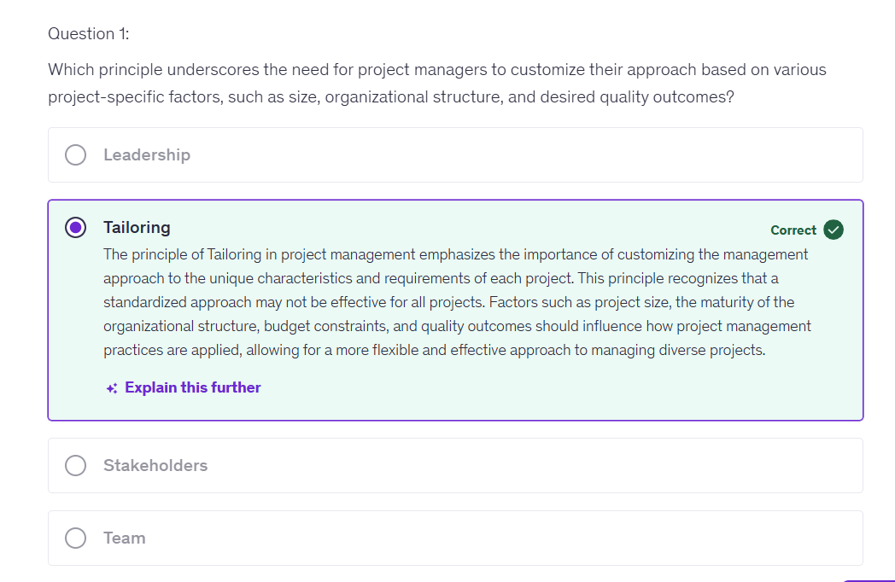

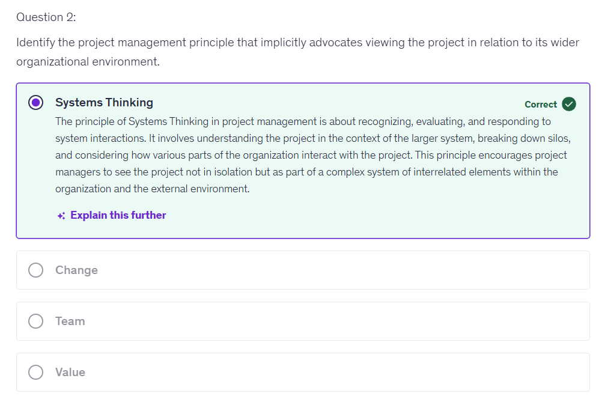

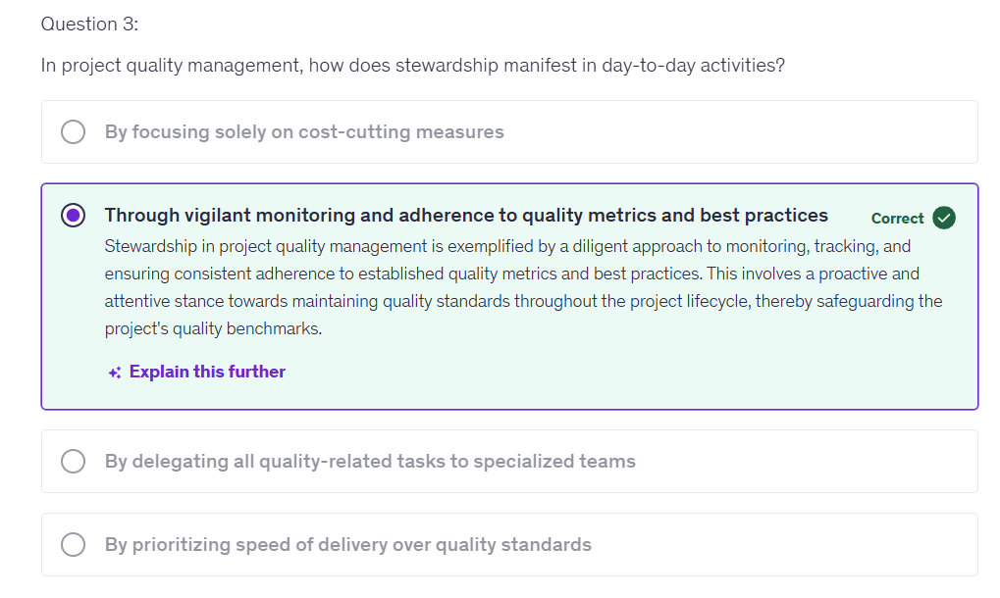

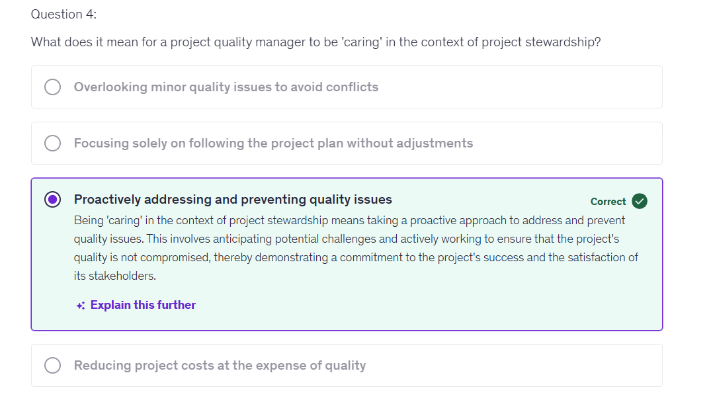

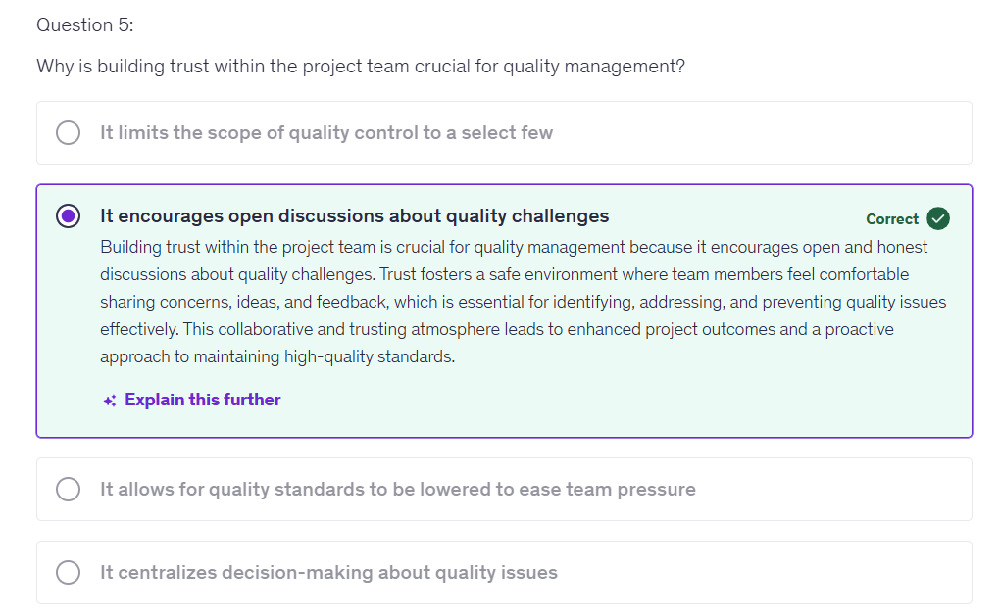

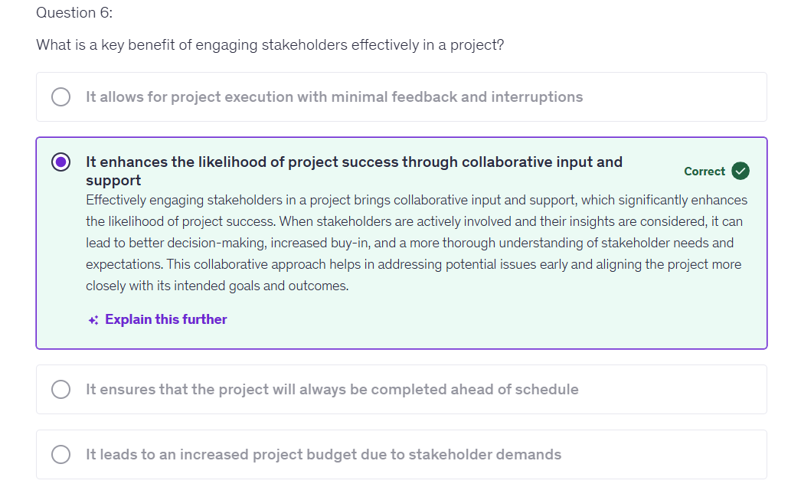

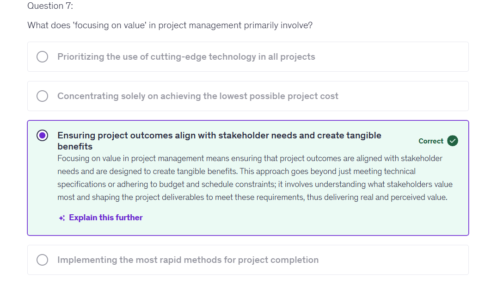

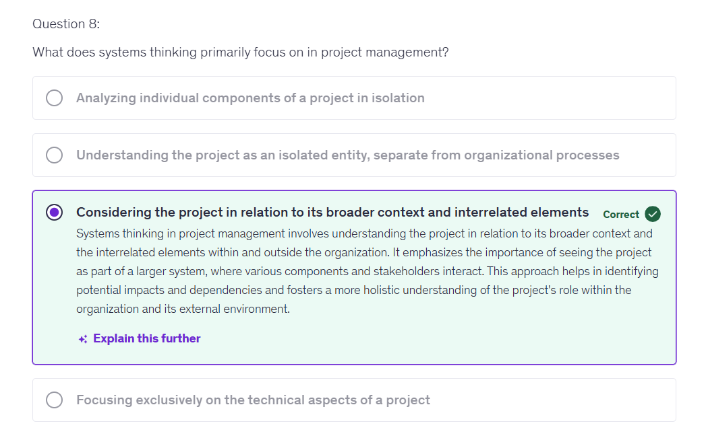

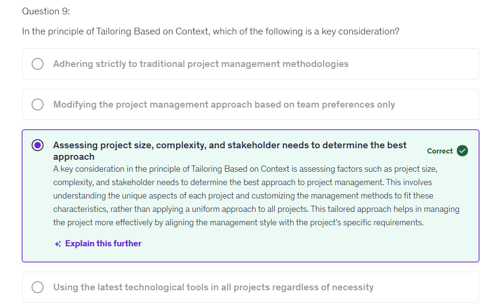

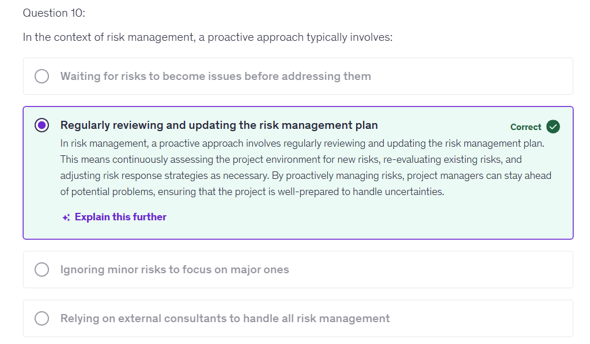

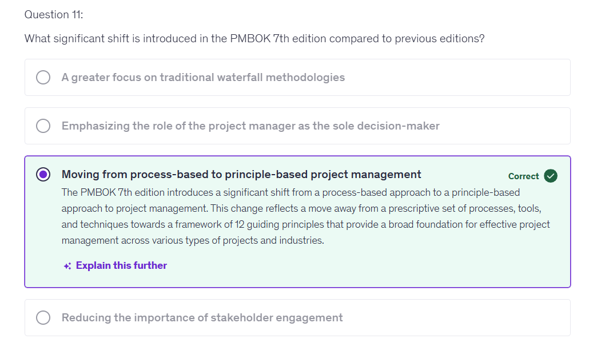

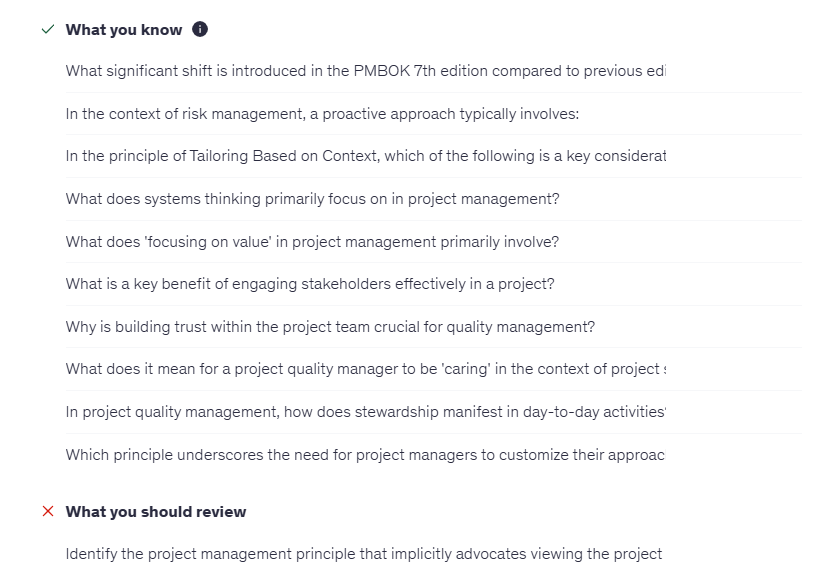