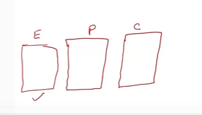
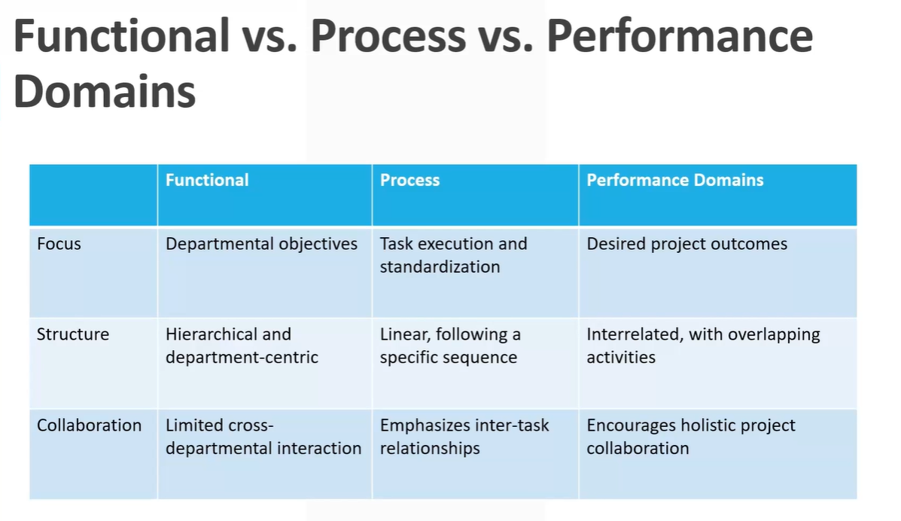

# Part 3 - Eight Performance Domains

## Project Stages

## Lifecycle of a Project

Understand the critical phases that guide the lifecycle of any project.

* **Five Key Phases: (Process Based Approach)**
  * **Initiating**: The beginning stage where the project's value and feasibility are measured.
  * **Planning**: Detailing the scope, time, cost, quality, communication, and risk of the project.
  * **Executing**: Turning the project plan into action.
  * **Monitoring and Controlling:** Ensuring the project stays on course as planned.
  * **Closing**: Finalizing all activities to close the project formally.

## 1. Initiating

The Initiating Process Group involves the activities to define a
new project or a new phase of an existing project.

**Key Activities:**  
Defining the initial scope, securing initial project funding, and
identifying stakeholders.

**Quality Aspects:**  
Ensures that the project aligns with organizational strategy
and stakeholder expectations.

**Example:**  
A project charter is often developed in this phase to provide a
formal authorization for the project.

## 2. Planning

To set the foundation for the project by clearly defining its
scope, aims, and strategic direction.

**Key Activities:**  
Creating a project management plan, defining and
sequencing activities, and developing a schedule and budget.

**Quality Aspects:**  
Focuses on developing a quality management plan to ensure
the project meets the defined quality standards.

**Example:**  
Organizing a brainstorming session with cross-functional
teams to identify potential challenges and innovative
solutions.

## 3. Executing

Implementation of the project management plan with an emphasis
on meeting defined quality standards.

**Key Activities:**  
Leading project tasks, enforcing quality checks, fostering team
cohesion, and stakeholder communication.

**Quality Aspects:**  
Regular quality assessments to ensure deliverables align with the
quality benchmarks set in the project management plan.

**Example:**  
Continuous quality improvement methodologies, such as PDCA
(Plan-Do-Check-Act), are implemented to maintain and elevate the
standard of deliverables.

## 4. Monitoring and Controlling

To keep the project on track and ensure the delivery meets the
quality standards.

**Key Activities:**  
Progress tracking, quality assessments, and problem-solving.

**Quality Aspects:**  
Actively manages the quality of the project's deliverables and
processes by using metrics and KPIs to gauge progress against the
quality management plan.
> Sometimes you have QPIs(Quality Performance Indicators)

**Example:**  
Regular quality audits are conducted to assess adherence to the
project's quality standards and identify areas for improvement.

## 5. Closing

The Closing Process Group ensures that the project is completed and
objectives are met.

**Key Activities:**  
Finalizing all tasks, delivering project outcomes to stakeholders,
securing stakeholder sign-offs, and releasing project resources.

**Quality Aspects:**  
Ensuring all deliverables meet quality standards and conducting a
comprehensive review to validate project outcomes against
objectives.

**Example:**  
Conducting a project closure meeting to review outcomes, gather
feedback, and discuss areas of improvement for subsequent
projects.

```txt
Now, once everything is done, then you reach to the closing stage and in the closing stage, what you do is you hand over whatever outcome of the project is.

Outcome of the project could be a big plant or a small app.

Whatever it is, you hand it over to the client.

That's what you do in the closing and you get signed off.

That okay client is happy with this.

Everything has been taken over.

So that's the closing aspect.

One thing which you would like to do during the closing stage is have a brainstorming session with the team and collect all the lessons learned and experiences which the team has gained, so that you can use those on the next project, so that the next project is much better or more effective than this current project.
```

> So these are typical five stages of a project execution.
> In addition to that, some places you will have different stages mentioned.

## Outcome Focused Project Steps

**Feasibility**: Validating the project's business case.  

**Design**: Crafting the blueprint of the deliverable.
Build: Constructing the deliverable with quality
checks.

**Test**: Quality assurance and final inspections.

**Deploy**: Transitioning the project deliverables
into actual use.

**Close**: Archiving knowledge and concluding the
project.

> So these are basically the steps of a project and typical role what a quality manager has in these stages.

## PMBoK 7th Edition

* Transition from 10 Knowledge Areas to 8 distinct
project performance domains.
* Each performance domain groups crucial activities
for effective project outcome delivery.
* Domains represent a holistic project management
system with interrelated management capabilities.
* Emphasis on the interactive, adaptable, and
interdependent nature of these domains.
* Focus shifts to achieving outcomes rather than
adherence to processes or artifact production.
* Domains are seen as interconnected units that
influence and react to each other.
* Change in one domain necessitates reviews
and adaptability across others.
* Performance is gauged through outcomes
rather than strict process adherence.
* The objective is to ensure comprehensive
value delivery across all domains.

**10 Knowledge Areas**  

1. Project integration management
2. Project scope management
3. Project time management
4. Project cost management
5. Project quality management
6. Project resource management
7. Project communications management
8. Project risk management
9. Project procurement management
10. Project stakeholder management

```txt
So these were ten different areas functional areas which the project manager has to deal with.

Now what has changed in PMBoK seventh edition is those ten knowledge areas have been replaced with eight distinct project performance domains.

Now what are these performance domains?

These performance domains are groups of activities, major activities which basically affect the project outcome.
```

## The 8 Project Performance Domains

1. Stakeholders
2. Team
3. Development, Approach and Life Cycle
4. Planning
5. Project work
6. Delivery
7. Measurement
8. Uncertainty

```txt
So remember that the project is complex.
There are so many inter relations you cannot look at scope as a separate topic.
Time as a separate topic and cost as a separate topic.
These are so interrelated that you cannot look at them in isolation.
So you look at them together.
And that's what is done in this body of knowledge, which is the seventh edition.
```

> And then as a project manager or as a project quality manager, you need to tailor them.

## Emphasis on Tailoring

* Recognizes the unique nature of projects and their
diverse environments.
* Stresses the need for flexibility and adaptability in
modern project management.
* Moves away from prescribing specific tools,
granting teams more autonomy.
* Supports the project management approach
without binding teams to certain methods.
* Encourages innovation and adaptability in tool and
method selection.

> So once again, the Project Management Body of knowledge seventh edition is not prescriptive.  
> This allows you to make changes depending on the situation depending on the project.


```txt
Now here in this seventh edition, when we are moving towards the performance domains, the emphasis is on interaction, how these things interact, how cost interacts with the scope, time, quality.

So how these things interact together.

That's how this body of knowledge, which is the seventh edition is framed on.
```

```txt
Another important thing in this edition, which is the seventh edition, is the emphasis is on tailoring.

So now if you look at these eight performance domains, these are not very prescriptive.

They don't say that okay.
You need to do this.
The project manager will do this.
The quality manager will do this.

They are basically giving you an overall guideline.

And then as a project manager or as a project quality manager, you need to tailor them.

Based on what this project is, how complex this project is, how bigger this project is.

Based on that, you need to tailor those requirements.

So once again, the Project Management Body of knowledge seventh edition is not prescriptive.
This allows you to make changes depending on the situation depending on the project.

And it is flexible and adaptable.

So with this it allows you the project manager or the project quality manager or other team members on the project to be more innovative, to be more adaptive in tool selection and the method selection,

rather than just following the specified steps or specified procedures or methods.

So that's basically a big change in the project management body of knowledge.

And here in this video we briefly talked about what are the key changes or the shift in the strategy.

In the seventh edition of PMBoK.
```

## 3c Process Approach v/s Performance Domains

```txt
So previously we talked about PMBoK seventh edition, and we looked at the major changes.
And one of the key change there was that instead of looking at the knowledge areas such as the scope,
time, quality, air, now the emphasis is on the performance domains.
Now before we go to those eight performance domains, I just want to take a moment and understand that.

What does that mean when we say performance domains?
Now before we talk about performance domains, there were two approaches of management.
```

### Functional v/s Process Approach

* **Functional (Department) Focus**
  * Based on organizational hierarchy.
  * Teams organized by specialized functions or departments (e.g., HR, Finance, Marketing)
  * Prioritizes departmental goals and objectives.
  * Often results in siloed operations with limited cross-departmental collaboration.



```txt
This is functional approach where each of these functions are carried out in a silo.
Engineering does the engineering procurement group consisting of people in that do all the purchasing
and construction group does the construction?

And as you could see, this is not going to work because there is inter relationship between these three
activities engineering, procurement and construction.
```


* **The Process Approach in Management**
  * A Process can cover multiple functions
  * Sequential or cyclical series of activities or steps.
  * Focuses on tasks and how they should be executed.
  * Emphasizes flow, efficiency, and standardization.
  * Aims to ensure consistency and repeatability in operations.


```txt
So if you look at ISO 9001 or any other standard, now the emphasis is on the process approach.
Rather than looking at the compartments or the departments, the emphasis is on the process.
Let's say one of the process here is designing.

So what is done in designing is basically engineering does the designing.

But then they need input from procurement.
They need input from construction.

So what we do in the process approach is rather than looking at these silos, we look at processes which
cut across these silos.
```

### Performance Domains

* **Performance Domains in Management**
  * Grouping of related management activities.
  * Outcome-centric, emphasizing desired project results.
  * Provides a holistic view of interrelated activities.
  * Flexible and adaptable to achieve specified outcomes.

```txt
So what we do in performance domains is that we group the related activity and we focused on the result.
We focus on the outcome.
And here, let's say one of the performance domains would be planning.
Now planning cut across all these things.

Planning looks at everything here and focuses on the outcome.
The outcome is the plan.

Now this involves every discipline, every activity, and it gives you a much bigger overview or a holistic view of all these interrelated activities.

And when you focus on outcome, you can be flexible to make all those adjustments and focus on the outcome.
This is what performance domains are.
```


## Summary



```txt
So this is basically the difference between the functional approach, the process approach and the performance domains.

So with this basic understanding of what performance domains are now let's look into those eight performance domains.
```

## 3d Performance Domains Intro

```txt
In the previous video, we talked about the difference between the functional approach, the process approach and the performance domains.

And one thing which we understood is that the performance domains are outcome focused or the result focused activities.

Now, in the project management body of knowledge, there are eight performance domains.

And once again, when we look at these eight performance domains, we will be looking from the lens of a project quality manager, even though originally they have been written for the project managers.

But what we will be looking at is from the point of view of a project quality manager.
```
### The 8 Project Performance Domains

The 8 Project Performance Domains

1. Stakeholders
2. Team
3. Development, Approach and Life Cycle
4. Planning
5. Project Work
6. Delivery
7. Measurement
8. Uncertainty

* **Stakeholder** Performance Domain: Engaging stakeholders and
understanding their needs, expectations, and interests to ensure
alignment and gain support throughout the project.

> In stakeholders performance domain we are looking at engaging stakeholders. Stakeholders could be client the management the public whosoever is stakeholders in that project and understanding their needs and expectations and interest so that we can align the output based on that.

* **Team Performance** Domain: Leading, supporting, and developing
a project team that is cohesive, motivated, and high-performing
to achieve project objectives.

* **Development Approach and Life Cycle** Performance Domain:
Choosing and adapting the project development approach, life
cycle, and practices based on the project environment,
complexity, and needs.

* **Planning** Performance Domain: Establishing the project structure
and ensuring that plans are created and maintained to guide
project delivery and measure performance.

* **Project Work** Performance Domain: Managing project
tasks, activities, and outcomes that adhere to policies,
processes, and procedures and deliver the intended value.

* **Delivery** Performance Domain: Producing and
disseminating project deliverables, ensuring they provide
the intended value, and transitioning the deliverables as
necessary.

* **Measurement** Performance Domain: Producing and
assessing project measurements to support effective
management and decision-making.
> Measurements related to planning, measurements related to execution measurements are related to team and so on. But our focus in this course will be measurements related to quality.


* **Uncertainty** Performance Domain: Assessing, managing,
and improving decisions and actions based on uncertainty,
ambiguity, and complexity within the project.
> So when you look at the word uncertainty look at that as risk.

## 3e Performance Domanin #1

```txt
Now when we talk of stakeholders, stakeholders could be client.
Your management stakeholders could be public, stakeholders could be government and so many other things.

But for the discussion, let's just focus on the client aspect here because that's a major stakeholder in any project.

So when it comes to stakeholder performance domain, as a project quality manager, your attempt would
be to understand what client needs from this project.
```

```txt
And once again, the original content of this, which is the stakeholder performance domains in the
PMBoK, is in regards to project manager.
Project manager has to look into so many things.

Project manager has to look into what are the stakeholders needs related to the cost, related to the
schedule, related to the time, and so on.

But as a project quality manager, your focus is on the needs and expectations of stakeholders in regards
to quality.
```


```txt
So as a project quality manager, you need to understand what are the needs, what are the expectations of your client.

Now where would you find those.
You will find those in the contract.

If you look into the contract, that will give you a good idea.
And once the project kicks off, then typically you will have a kick off meeting and internal kickoff
meeting and external kickoff meeting with the client.
That's where you will get a more idea about what the client needs or the stakeholder needs are.

And then maybe you might want to have a meetings and interviews with the client counterparts so that
you have a good understanding of what client's needs and expectations are.
As an extra step, you would prioritize them.

Not all needs and expectations are equal.
Some of them are high priority for client.

That's where you would be focusing on as a project quality manager.
```

```txt
And based on this you will identify some of the quality matrix, which you will be monitoring based
on what client needs.
And when it comes to measuring those matrix that we will be discussing in the measurement performance
```
