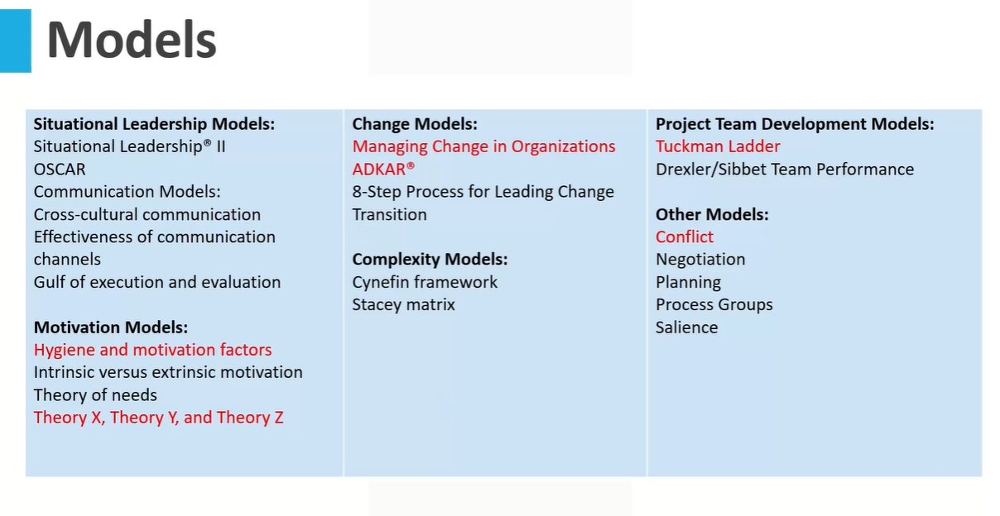
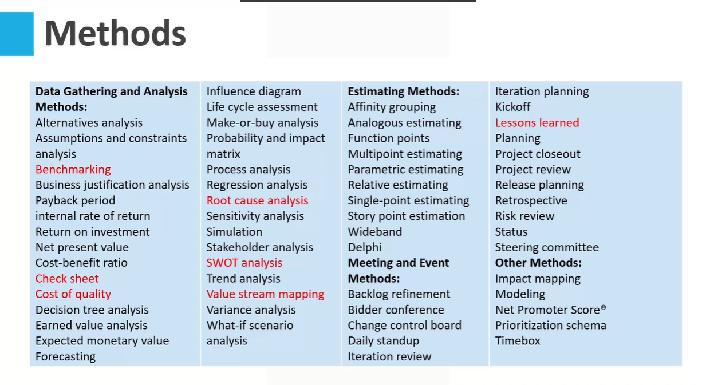
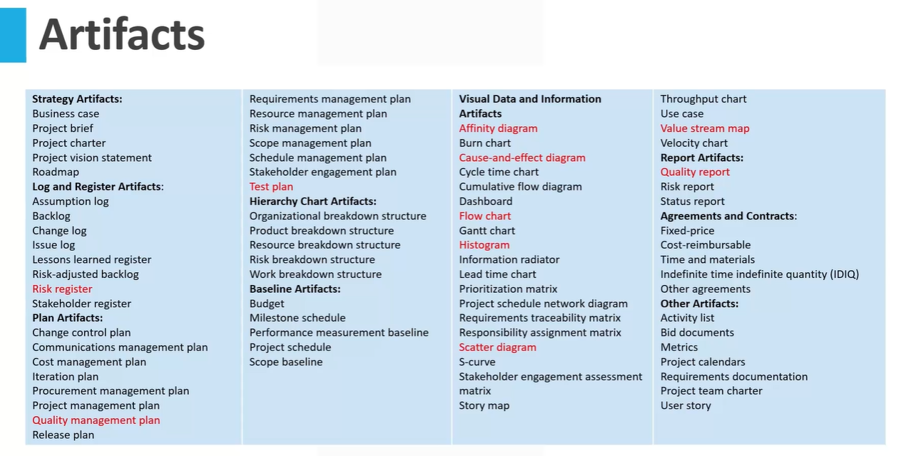

# Part 4 - Models, Methods and Artifacts

## Model, Methods and Artifacts

* This section sheds light on the commonly
employed models, methods, and artifacts that
aid in managing projects effectively.
* **Model**: A strategic thought pattern designed to explain
a specific process, framework, or phenomenon.
> So model is basically a sort of a theory or a thought pattern.

* **Method**: The approach taken to achieve a specific
outcome, output, result, or project deliverable.
* **Artifact**: Can range from a template to a document,
output, or any project deliverable.

```txt
Now in this section we will be looking at the models methods and artifacts.

So when we say models, methods and artifacts this is the term given by the Project Management Institute

in the PMBoK, which is the project management body of knowledge.

Now if I just have to look at this in simple terms, I would look at them as tools.

So these are basically tools which will help us in performing those activities which are part of performance

domains, which we discussed earlier.
```

```txt
And now when we say models, methods and artifacts, these are not something which are formed, which
need to be followed on each and every project.
We did talk about tailoring earlier.
So what we are expected to do is use these models, methods and artifacts as appropriate for the type
of project you are dealing with.
So for that, what you need to do is you need to tailor them.
And tailoring is basically adjusting these tools to the need.
```

### Tailoring

* Their utilization is not rigid. They offer flexibility and can
be tailored to fit the unique requirements of each
project.
* Tailoring involves aligning the project's tools and
techniques, such as models and methods, with its
specific needs and context.
* It ensures that deliverables and artifacts are optimized
for the project's internal environment and external
circumstances.
* Project teams should consider them as adaptable tools,
adjusting and employing them in ways that best align
with the project's goals and context.

```txt
So whatever works for your project, use those tools, use those models, methods and artifacts.
Now when we say model methods and artifacts, your next question would be, okay, show me an example
of that.
```



```txt
So what PMI has done is they have given a list here.
Here is the list of models which has been given in the PMBoK.

So what we will be doing is since we are not covering the role of a project manager, what we are covering
here in this course is the role of a project Quality Manager.

So what we will do is we will select some of these models, methods and artifacts which are more suitable
for the project Quality manager.
```





The items marked in red will be covered in this course