# 4b Models - Motivational Theories

> And once again when we say model, model is a thought pattern to explain a process or a framework or a phenomena, that's basically a bigger framework or a bigger theory, which explains how things are working.

## Summary of Motivational Theories

* **Maslow's Hierarchy of Needs:** Motivation through
fulfilling a hierarchy of needs, from basic (physiological)
to advanced (self-actualization).
* **Herzberg's Two-Factor Theory:** Differentiate between
hygiene factors (preventing dissatisfaction) and
motivation factors (encouraging performance).
* **Theory X, Y, and Z:** Reflects a spectrum of management styles:
  * Theory X suggests that employees require strict supervision and external motivation.
  * Theory Y suggests that employees are self-motivated and seek responsibility.
  * Theory Z focuses on stable employment, collective decision-making, and holistic concern for workers.

### Maslow's Hierarchy of Needs

* Fundamental Premise: Human behaviour is motivated by a series of hierarchical needs.
1. **Physiological Needs:** Basic survival needs include food, water,
warmth, and rest.
2. **Safety Needs:** Security and safety, including personal security,
employment, resources, and health.
3. **Love and Belonging Needs:** Relationships and belonging, such as
friendship, intimacy, and family.
4. **Esteem Needs:** Respect and recognition, including self-esteem,
status, and recognition from others.
5. **Self-Actualization:** Achieving one's full potential and creative
activities.

### Hygiene and Motivation Factors

* Understanding Employee Satisfaction:
Herzberg's Two-Factor Theory divides factors
affecting work satisfaction into two categories:
**hygiene factors and motivation factors.**
    * **Hygiene factors** are necessary to ensure an employee
is not dissatisfied.
    * **Motivation factors** drive an employee to higher
performance and satisfaction.

### Hygiene Factors

* Preventing Dissatisfaction: Hygiene factors are
foundational elements of the work
environment.
    * Encompass basic conditions such as fair pay, safe
working conditions, reasonable work hours, and job
security.
    * Also include interpersonal relations, company policies,
and administrative support.

* Role of Project Managers: Ensuring these
factors are adequately addressed to prevent
project team dissatisfaction.

### Motivation Factors

* Encouraging High Performance: Motivation
factors relate to what makes work fulfilling.
    * Include elements like challenging work, recognition for
achievements, and growth opportunities.
* Application for Project Quality Managers:
  * Integrating recognition into quality milestones.
  * Assigning responsibilities that challenge team members and acknowledge their expertise.
  * Promoting a culture of continual improvement that
aligns with personal and project goals.

### Theory X

* Theory X: Assumes that employees are
naturally unmotivated and dislike work,
necessitating control and often coercion to get
them to perform.
* Management is authoritative, with a strong
emphasis on control.
* Employees are expected to be motivated by
external factors, such as money and the threat
of punishment.

> Now, whether this is a good theory or bad theory, I'll leave it up to you. Coming to theory y. Theory Y is opposite of theory X.

### Theory Y

* Theory Y: Suggests that employees are self-
motivated and thrive on responsibility.
* Management is participative, encouraging a
more collaborative and trust-based
relationship.
* Employees are seen as enjoying their work
and seeking out responsibility, with motivation
coming from intrinsic factors like fulfillment
and the desire to achieve.

```txt
And the role of management is to participate, to provide those resources and build trust with the employees.
And the motivation here is not the money.
Motivation here is to do a good job, fulfil their desire, achieve their goal.
That's what theory Y assumes.
```

### Theory Z

* Theory Z: Offers a blend of Eastern and
Western philosophies, focusing on long-term
employment, collective decision-making, and
individual responsibility.
* Management tends to be more holistic,
emphasizing employee well-being alongside
productivity.
* Motivation is fostered through job security,
promotion from within, and a focus on the
well-being of the employee and the
organization.

```txt
Now, when we looked at theory X, Y, and Z, or theory Z, I don't say which one is good or bad.

I leave it up to you and it might depend on situation.
It might depend on circumstances.
What theory you might want to apply for the team motivation.

So these are the key motivational theories which we covered here for the role of a project quality manager.

The next thing what we will be looking is at the change management.
```

## 4c Model - ADKAR Change Model

> Now coming to the next model in this list, which is related to the change management managing change in organization.

### Introduction: Change Management

* **Definition of Change Management:** Applying a
structured process and tools for leading the
people side of change to achieve a desired
outcome.
* **Importance in Projects:** Ensures that changes
are smoothly and successfully implemented to
achieve lasting benefits.
* **Goals:** Minimizing resistance, engaging
stakeholders, and promoting effective
communication.

### ADKAR Model

* **ADKAR Model:** A goal-oriented change
management model that guides individual and
organizational change.
* **Components:** ADKAR is an acronym representing
five tangible and concrete outcomes people need
to achieve for lasting change: **Awareness, Desire, Knowledge, Ability, and Reinforcement.**

```txt
So these are the five steps which we take as a part of change management by using this model.
This will reduce the resistance people have when it comes to implementing change.

People like to work the way they have been working.
People by default will resist change and that's where you need the help of these types of models.
```

* **Application in Projects:** The model is used to plan
change management activities, diagnose
resistance, and help integrate change into the
project planning.

#### ADKAR Step 1: Awareness

* **Creating Awareness:** Explaining the need for
change.
* **Strategies for Projects:** Engage leaders as
change sponsors, communicate clearly and
effectively, and provide information on the
business context and reasons for the change.

#### ADKAR Step 2: Desire

* **Fostering Desire to Support the Change:**
Motivating the team and stakeholders to get
involved and support the change.
* **Strategies for Projects:** Involve team members
in the change process, address individual
concerns, and align the change with personal
values and goals.

#### ADKAR Step 3: Knowledge

* **Building Knowledge on How to Change:**
Providing the information and training needed
to know how to change.
* **Strategies for Projects:** Deliver training
sessions, provide access to information, and
ensure that support is available.

#### ADKAR Step 4: Ability

* **Developing the Ability to Implement Required Skills and Behaviors:** Ensuring that the team
and stakeholders have the capability to adopt
the change.
* **Strategies for Projects:** Practical application
through role-playing or simulations, step-by-
step guidance during the transition, and
performance support.

#### ADKAR Step 5: Reinforcement

* **Implementing Reinforcement to Sustain the Change:** Taking actions to ensure the change
sticks.
* **Strategies for Projects:** Recognize and reward
successful change adoption, collect and share
success stories, and implement feedback
mechanisms for continuous improvement.

```txt
And the fifth step is the reinforcement.

So once the change has been implemented everyone is using the new system.
You need to make sure that the new system sustains.
And people continue to use this new system.

And if you don't keep this reinforcement, there is a good chance that people will shift back to the
old system.

A smallest problem comes and people will start complaining that no, the new system is not working.

Let's go back to the old system.
So you need to keep the continuous reinforcement.

You need to provide the continuous support to make sure that the new system remains implemented.
```

```txt
So here in this you would be recognizing any successful change adoption.
So one team has adopted successfully what lessons they have learned, what tricks they have learned
to make sure that new system gets implemented and if they have any feedback to improve this new system
that is also collected.

And there is a continuous improvement mechanism to make sure that the new system stays.
So this was the model of change management.
```

### 4d Model - Tuckman Ladder

* The Tuckman Ladder, also known as Tuckman's stages of
group development, is a model that describes the stages a
group goes through to become a high-performing team.
* Proposed by Bruce Tuckman in 1965.
* **Comprises five stages:** Forming, Storming, Norming,
Performing, and Adjourning.
* Recognizing and navigating through each stage of the
Tuckman Ladder is essential for team success.
* Each stage presents its unique challenges and
opportunities.
* Leaders and team members must adapt their approach as
they progress through the stages to ensure a cohesive and
high-performing team.

* **Forming**:
  * Team members meet and learn about the project.
  * Uncertainty about roles and team objectives.

```txt
So here as a first step in the forming, they need to understand what this project is about, what the
roles and responsibilities are.

Many a times a kick off meeting on the project, which is internal kickoff and external kickoff, helps

in passing through this phase faster, where team understand that what this project is, what their roles and responsibilities are.
```

* **Storming**:
  * Conflicts arise around team dynamics and project direction.
  * Members vie for influence; disagreements are common.

* **Norming**:
  * Team starts collaborating effectively.
  * Clarity in roles and mutual respect develop.

```txt
So at the end of storming stage, all those disagreements are sorted out.
Team agrees on a way to do things for this project, and that is basically the norming stage where team
starts working collaboratively, effectively.

And here there is a good clarity on roles and there is a mutual respect for each other.
I will be doing this.
You will be doing this.

This is the approach we will do and let's do this project.
```

* **Performing**:
  * Team operates efficiently with established processes.
  * High interdependence, motivation, and shared vision.

* **Adjourning**:
  * Completion of the project; team prepares to disband.
  * Reflection on achievements; potential feelings of closure.

```txt
Then the next stage will be adjourning.
Adjourning was a step which was added later on.
This is more relevant to the project environment, where the team works on a project and then gets disassembled.
```
```txt
So that is a joining stage that once the project is completed, the team is disbanded.
So each one goes back to their respective work areas or department, or they move on to the next project
once the project objectives are achieved.
So basically this is a reflection of achievement.
And with this the project is closed.
```

```txt
Understanding these steps.
Understanding these stages as a quality manager will help you in understanding that what you need to
do to make sure that the team reaches to the performing stage faster.
So this was the team development model or the tuckman ladder.
```

## 4e Model - Conflict Resolution

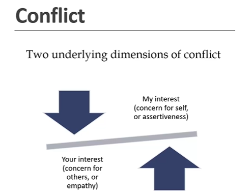

```txt
Let's think of this in the terms of quality manager and the project manager.

So I means I'm the project quality manager.
And you means the person in front of me is the project manager.
Now, there might be conflict.

Now what sort of a conflict which we might have as a project quality manager.
Let's take a scenario where we have an audit planned this month and we want to conduct the audit, but
then the project manager says that no, you cannot conduct audit this month.

Move it by another two months because there is an important deliverable which we have to issue to the
client.

So we cannot do audit because that will be distraction to the team.
Okay, that's a conflict.
```

**Important**

```txt
So as a project quality manager, you will have to deal with multiple conflicts where your requirement
and the other person requirements differ.
That's what conflict is.

Basically, it's a balance between your interest and my interest.
My interest is represented by assertiveness.

I assert my interest and your interest.

That means the interest of other party is shown by the empathy that I take care of other person's interest
as well.
```


```txt
So based on these two dimensions, a conflict could be put into a two by two matrix.
Let's look at that.
So based on the empathy and assertiveness here we have a two by two matrix.
```

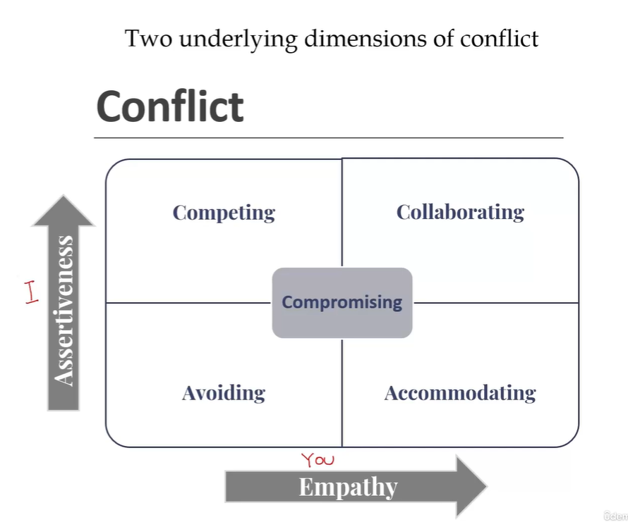

```txt
Here I is basically the quality manager and you is the person in front of me, which is the project
manager.

So depending on whose interest we are covering here, we have a two by two matrix.
```

1. **Avoiding**

> Avoiding is basically low empathy and low assertiveness. Basically I lose. You lose. Neither my interest is covered nor your interest is covered. So you might want to use avoid strategy where things are not important.Things really do not matter on a small trivial matters. You don't want to have a conflict there. You might want to go for avoiding as a strategy.

2. **Competing**

> On the other hand, if I look at this strategy, which is competing, competing is high on assertiveness. That means I'm taking care of my interests. So basically I win and it is low on empathy. So basically that means you lose so I win. So here I'm competing for my interest, I'm fighting for my interest. And I want other party to lose. That's basically competing where my interest is more important than other parties interest.

3. **Accomodating**

> Accommodating is high on empathy and low on assertiveness. Basically, I'm not pushing my interest, I'm on losing side. So basically I will say I lose, you win. I'm compromising on my situation, on my stand, and I'm allowing other party to win. So you might want to use this as well at certain times where you accommodate other party's interest.

4. **Collaborating**

```txt
Coming to the fourth strategy, which is collaborating.
Collaborating is basically working together.
You win, I win, I take care of your interest as well as my interest together, since this is high
on empathy and high on assertiveness.

So I win.
You win.

This would be, I think, the most preferred strategy where you want to resolve an issue or a conflict where both parties interest is covered.
```
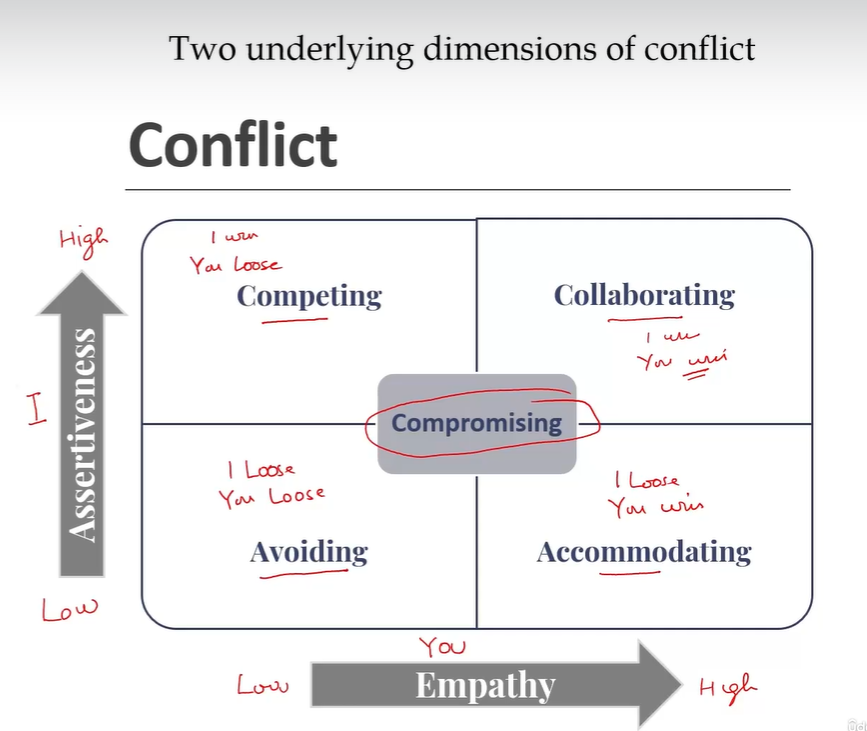

```txt
In between these four boxes.
In the middle you have compromising.
Compromising is basically the middle ground where you compromise a little bit, other party compromises
a little bit, and you reach to a conclusion.
```

```txt
Let's take an example of, let's say that equipment, which was at the supplier, which had quality
issue, and the project manager wants to ship that.
So we might want to have a compromising strategy where we might take an undertaking from the supplier
that the supplier will come to the site and correct all those deficiencies, or maybe they will pay
for those deficiencies and we might get that corrected.
So here basically I'm compromising a little bit that I'm allowing the defective equipment to be shipped.
And the project manager is also compromising that okay, we will address those issues here at site.
That's a compromising.
```

* **Competing** (High Assertiveness, Low Empathy)
  * Represents a power-oriented mode where one's own interests are pursued at
the expense of others.

* **Collaborating** (High Assertiveness, High Empathy)
  * Involves working with others to find a solution that fully satisfies the concerns
of both parties.

* **Compromising** (Moderate Assertiveness, Moderate Empathy)
  * A middle-ground approach where each party gives up something to reach a
mutually acceptable solution.

* **Avoiding** (Low Assertiveness, Low Empathy)
  * Involves withdrawing from or sidestepping the conflict altogether.

* **Accommodating** (Low Assertiveness, High Empathy)
  * Opposite of competing, emphasizing the needs and concerns of the other
party rather than one's own.

```txt
So we have five strategies here competing, collaborating, compromising, avoiding and accommodating.

Depending on whether we are looking at high or low assertiveness and high or low empathy.
Now there are multiple factors which will play when selecting the right strategy.

So it might depend on the value of the issue, how important that issue is to you, because you don't
want to keep on fighting for every small issue.
So you need to see that what is more important.
So depending on that, you might want to choose the right strategy.

If you understand what are the consequences of that.
That also will help you in choosing the right strategy.
And sometimes you will see that what time and resources you have to deal with that conflict.

So depending on multiple factor, you might want to choose the right strategy for conflict resolution.
```

* **Factors in selecting the approach:**
  * Value of the issue
  * Understanding the consequences
  * Time and resources needed

> So this completes our discussion on the models which we wanted to discuss as a part of project Quality Manager training.

## Quiz

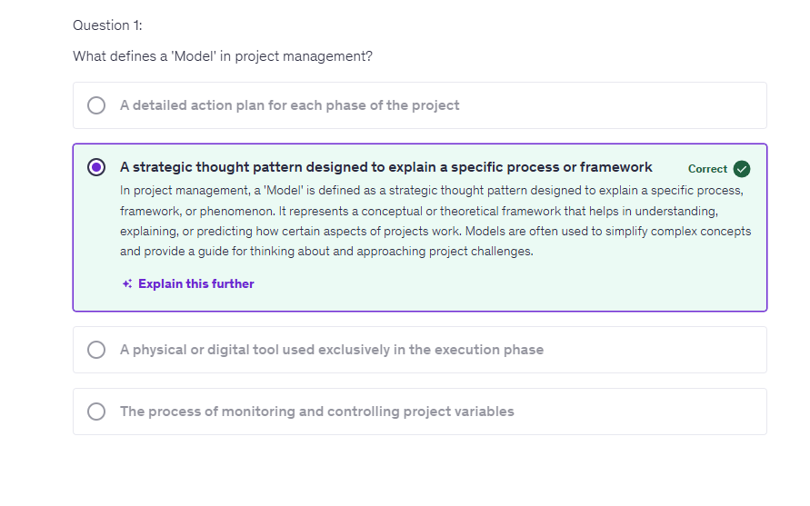

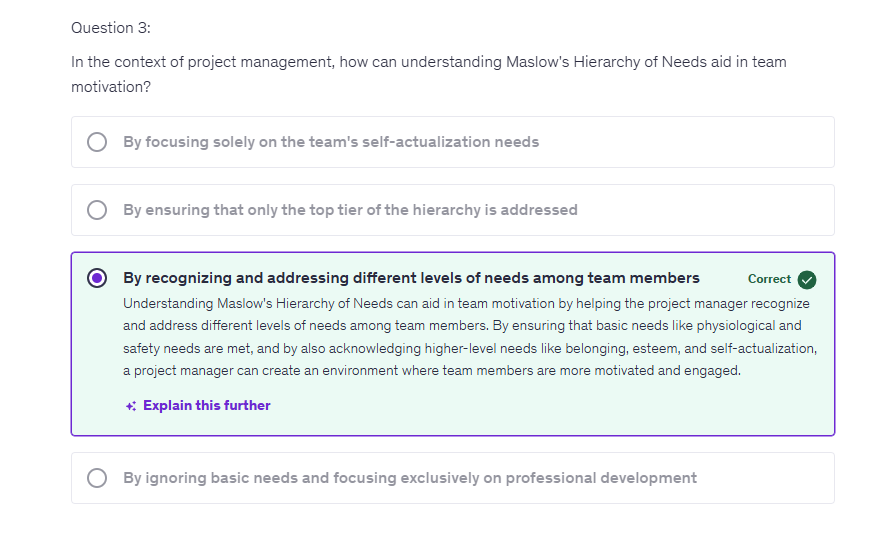

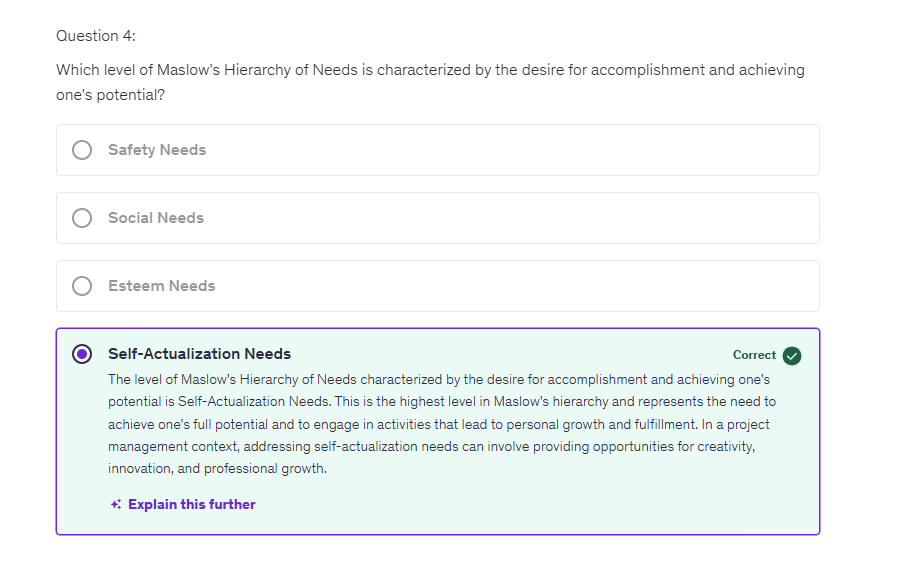

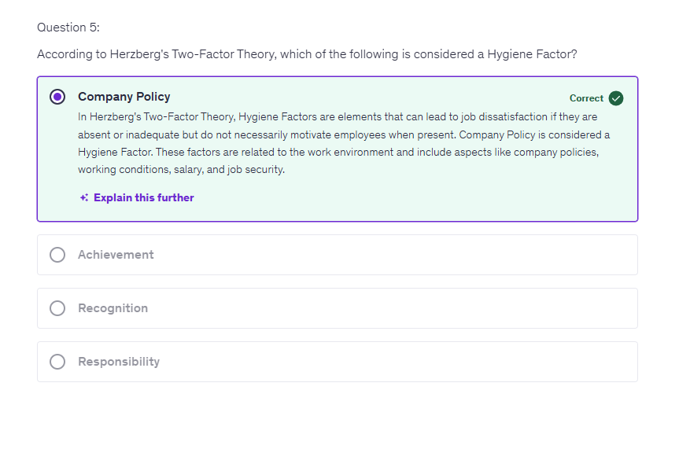

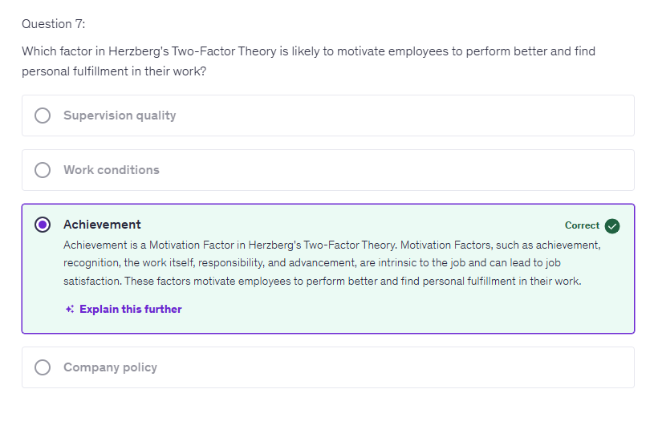

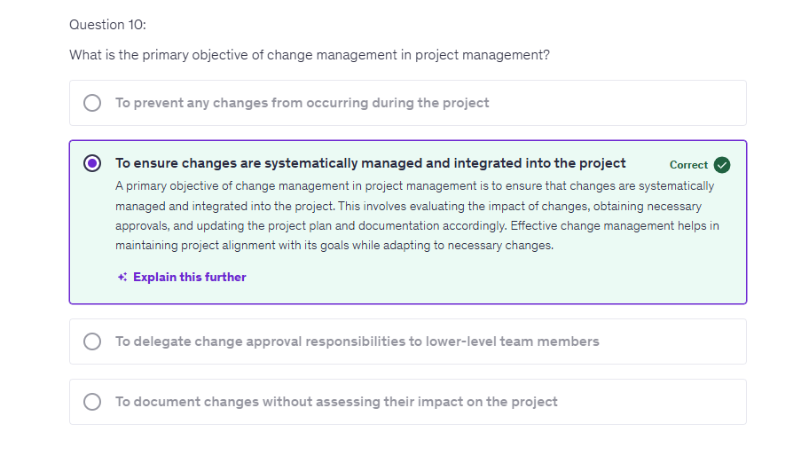

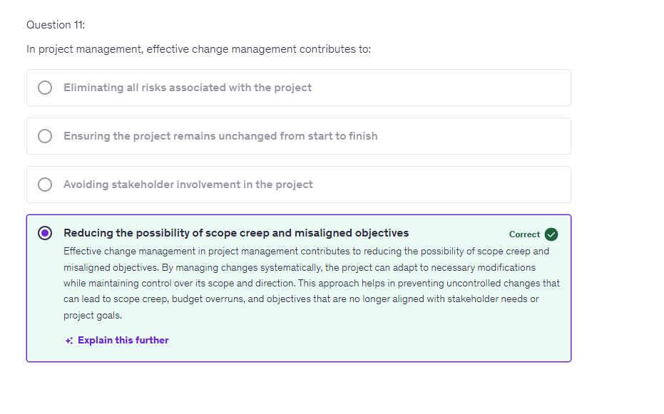

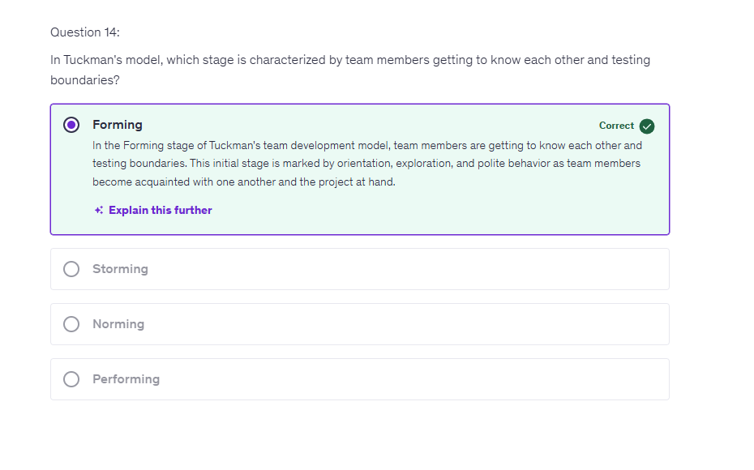

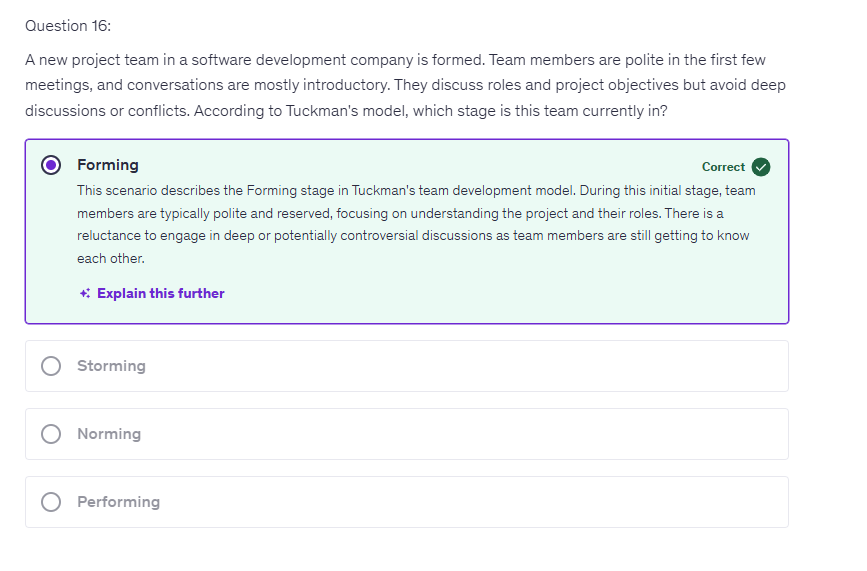

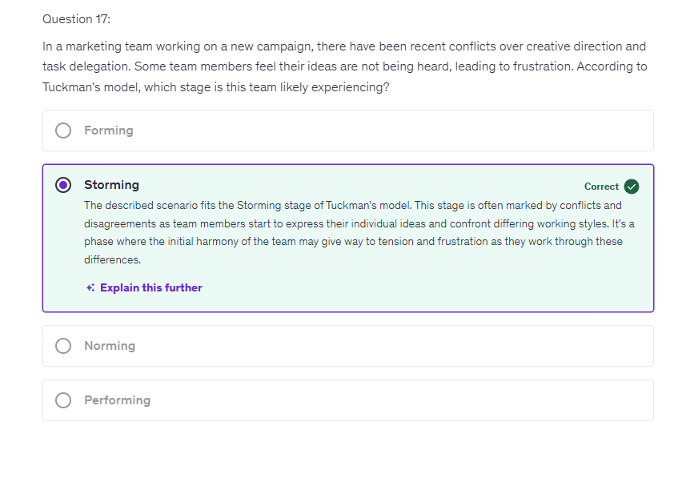

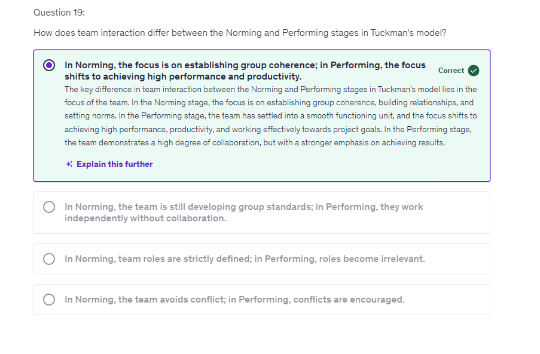

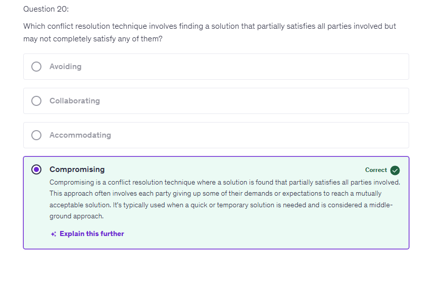

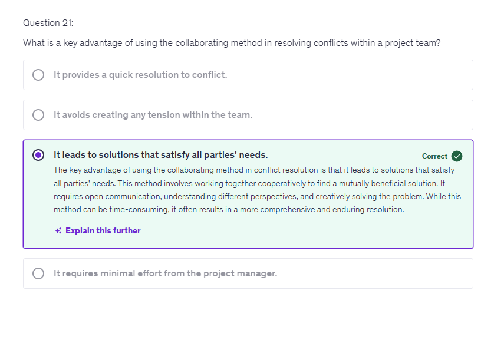

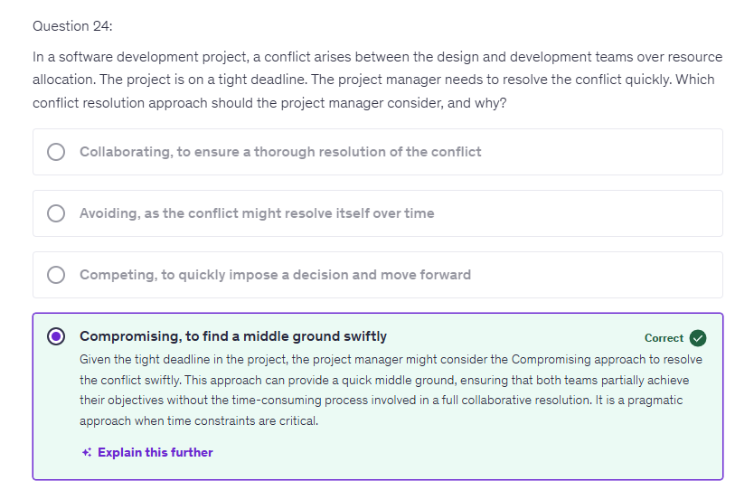

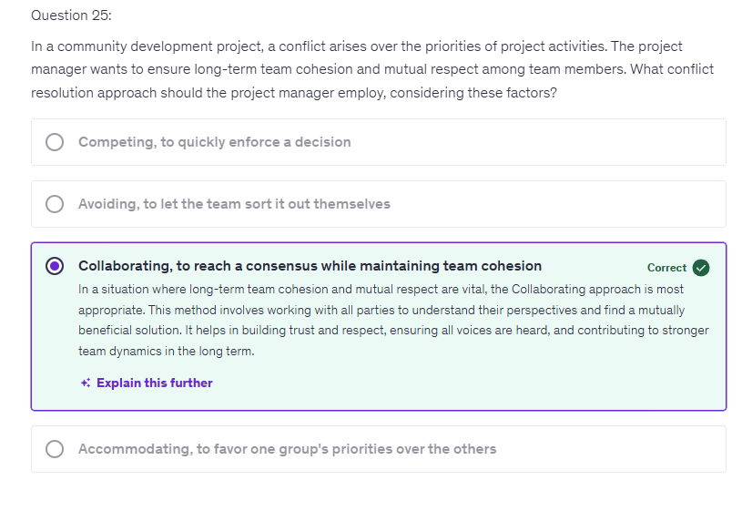