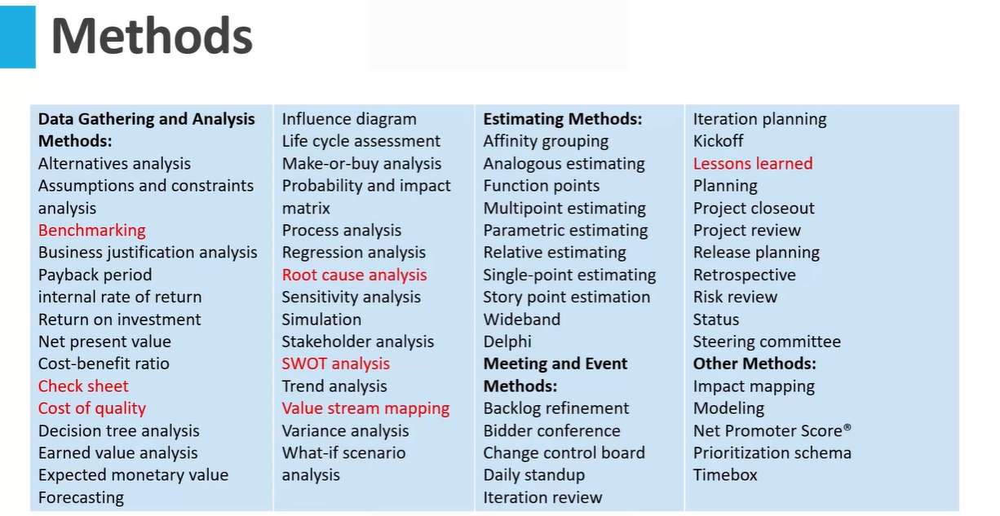
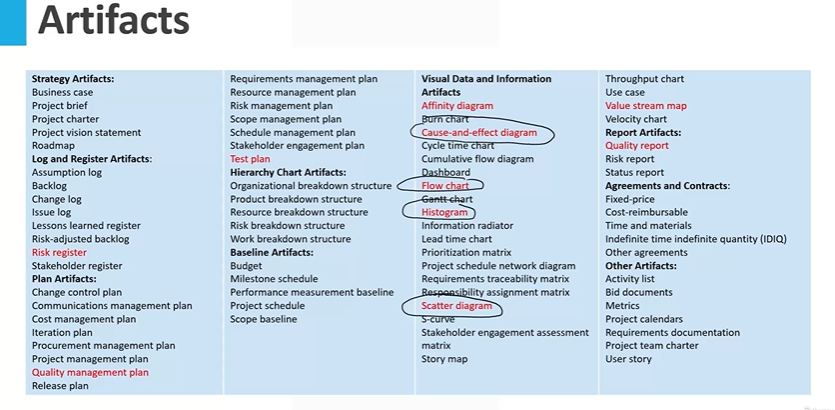
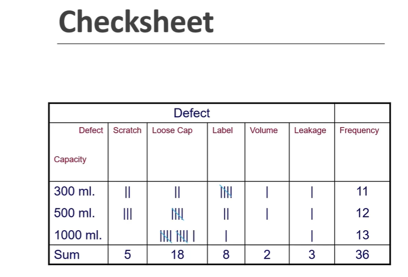

# 4f Methods - Introduction



> Methods are the approaches taken to achieve a specific outcome or a result or a deliverable.

## 4g Methods - BenchMarking

## Introduction to Benchmarking

* **Definition of Benchmarking:** Benchmarking is the
process of comparing your processes and
performance metrics to industry bests or best
practices from other companies.
* **Purpose**: The goal is to gain insights that can help
improve performance, efficiency, and
effectiveness.
* **Scope**: Can cover various aspects including time,
cost, quality, and customer satisfaction.
* **Benefits**: Helps organizations identify improvement
areas, innovate, and stay competitive.

```txt
And now when it comes to benchmarking in the context of a project, you might be looking at doing the
project faster.

So you might want to compare the time you take to perform a project versus your competitor, or maybe
some other part of your company, so that you can improve the timely delivery of the project.
You might want to do benchmarking on cost, on quality, or on customer satisfaction.

So these are some of the areas where you might want to consider benchmarking, where you want to compare
your performance with the best in class performance.
And once again, the benefit of doing benchmarking is to improve the performance of the organization, to deliver the project faster, deliver the project better, cheaper, or make the client more happier.
```

### Types of Benchmarking

* **Internal Benchmarking:** Comparing practices and
performance across different organizational
departments or teams.
* **Competitive Benchmarking:** Assessing your processes
and performance against direct competitors.
* **Functional Benchmarking:** Looking at how similar
processes are managed in different industries.
* **Generic Benchmarking:** Comparing operations that are
similar in function but applied in different contexts.

```txt
You might have seen how the tires get changed in the formula one race.
So there is a team of people and within fraction of seconds, or maybe within few seconds, they change
all the four tires of formula One car.

You can use that approach to do or improve your performance related to some other delivery, how fast
you can make a particular document, learning from the tire changing and the last item or the last type
of benchmarking.
```

* **Strategic Benchmarking:** Evaluating the long-term
strategies that lead to high performance in other
organizations.

### Implementing Benchmarking

```txt
One important thing, rather than going through the whole slide, is it is first important to understand
how you are performing your processes.
So you need to have a very good understanding of how the process is performed within your own project,
within your own organization, before even you think of doing benchmarking.
```

**Data Collection:** Gather data on performance metrics,
processes, and practices from your projects and those
you want to compare against.

**Analysis:** Identify the gaps between your performance
and the benchmark. Understand the underlying
practices that lead to higher performance.

**Planning:** Develop strategies to close performance gaps,
including setting realistic, achievable goals.

**Implementation:** Apply the improvements to your
processes, monitor changes, and adjust as necessary.

**Review and Continual Improvement**: Regularly review
the outcomes of benchmarking efforts to ensure
continuous improvement.

```txt
Now as a project quality manager you might want to think yourself that which processes you want to improve
and what benchmarking type you want to use.
Whether you want to benchmark that process against some internal process on some other project, or

you might want to benchmark against some external company or your competitors, or you might want to
do some generic benchmarking.
```

## 4h Methods - Checksheets

```txt
Now check sheet is one of the seven basic quality tools.
So if you have heard of that term there are seven basic quality tools which were established in Japan,
where each worker in the factory was expected to understand these seven basic quality tools for the

process improvement.
Check sheet is one of those items.
```



```txt
These items also are part of the seven basic quality tools.
So check sheet is one.
And then there are four of these listed here in artifacts.
```

### Seven Basic Quality Tools

**Overview:** The seven basic quality tools are fundamental to
improving product quality and process quality in project
management and operations.

**Purpose:** These tools are used to collect data, analyze
processes, and drive improvements.

* List of the Seven Basic Quality Tools:
  * **Checksheet**
  * **Cause-and-effect diagram (also known as a fishbone or Ishikawa diagram)**
  * Control chart
  * **Histogram**
  * Pareto chart
  * Scatter diagram
  * **Flowchart**.

### Checksheet

* **Definition**: A checksheet is a structured,
prepared form for collecting and analyzing
data.

* **Functionality**: This tool systematically collects
data on a process and can be customized
according to the data being collected.

* **Purpose**: Helps in understanding the
frequency of problems or defects and
identifying patterns over a period of time.



```txt
Typically when there was a manufacturing ongoing.

And an operator will keep a note of things, what they would do is they will use check marks.
So let's say if they have a problem in piece number A.

So here I have piece number A or item number A.
Here I have item number B.
So whenever let's say they find a defect or something they will check mark here.
So one item A has a problem.
Then the item B had a problem.

So you put a check mark here.
So they will keep on putting these check marks.

But then after four check marks they will put a cross mark here.
So basically this is a group of five items.

So there are five defects or five problems in the product a.
And then there is a one problem in product B.
This is how typically check sheet was used initially.
```

```txt
In this case I have a water bottle filling plant.
There are three types of water bottles being filled 300 milliliter 500 milliliter 1000ml.
And we have a different types of defects.
So as the operator notes down the defect they will keep on adding tally marks to this.
So for example a 300 milliliter bottle there was a scratch.
So they will put a one check mark here.
Second time the scratch come they will put another check mark here.
And once you have four of them the fifth one will be crossed here.
So basically here looking at this you can understand that let's say the loose cap is one of the biggest
problem in all of these bottles.
And particularly this is a big problem in 1000ml bottle.
So basically check sheet gives you a good understanding of the distribution of the problems right now.
Or in today's world you won't be putting these check marks.
Typically no.
Maybe you might be putting but typically you might not be putting that data is collected electronic,
but the intention of check sheet is to collect data which could be analyzed later on.
```

### Checksheet vs. Checklist

* **Checksheet**:
  * Used for data collection and analysis.
  * Structured to allow for data aggregation and identification of trends or patterns.

* **Checklist**:
  * Simple list used as a reminder tool.
  * Used to ensure that all steps or items are completed or checked.
  * Not typically used for data analysis or trend identification.

## 4i Methods - Cost of Quality

## Cost of Quality

* The Cost of Quality (COQ) methodology is a
strategic approach that seeks to determine the
most effective balance between investments in
quality prevention and appraisal in order to reduce
defects and failures.
* At its core, COQ categorizes costs into four main
groups: Prevention, Appraisal, Internal Failure, and
External Failure.
* By effectively understanding and managing these
costs, organizations can achieve better compliance
with quality standards and ultimately enhance
project outcomes.

```txt
The next method in this list is the cost of quality.
Now the concept of cost of quality is that it gives us a strategic approach to seek a balance between
the quality cost components.

So there are four broad components of the cost of quality, which are the prevention cost, appraisal
costs, internal failure and external failure costs.
So when you want to achieve quality, there are four ways you can spend money on that to achieve quality
prevention, appraisal, internal failure and external failure.
Having a good understanding of these costs will help you determine that where you should be putting
more effort on.
```

### 1. Prevention Cost

* **Investing in Proactive Quality Measures**
  * Prevention costs are primarily incurred to
proactively eliminate potential defects and prevent
failures from occurring within the product or
service.
  * These costs are directly associated with designing,
implementing, and consistently maintaining an
effective quality management system.
  * The primary goal of incurring prevention costs is to
avoid quality-related problems from the outset,
ensuring that the project starts on a strong
foundation of quality adherence.

**Examples  of prevention cost**

* **Product or Service Requirements:** It involves establishing
detailed and clear specifications for incoming materials,
processes, finished products, and services to ensure they
meet the desired quality standards.
* **Quality Planning:** This entails the creation and continuous
updating of plans dedicated to quality, reliability,
operations, production, and thorough inspection
processes.
* **Quality Assurance:** This involves setting up and maintaining
a robust quality system that ensures consistent delivery of
quality across all project phases.
* **Training:** Investing in training programs' development,
preparation, and upkeep ensures that all project members
are well-equipped to maintain and uphold quality
standards.

### 2. **Appraisal Cost**

**Ensuring Adherence to Quality Standards**  

* Appraisal costs are dedicated to determining the
degree to which the project conforms to
established quality requirements.
* These costs are associated with measuring,
monitoring, and evaluating various quality-related
activities throughout the project lifecycle.
* Ensuring that purchased materials and in-house
processes align with predetermined specifications
is a cornerstone of appraisal costs.

**Example of Appraisal Cost**  

* **Verification:** This process involves thoroughly
checking incoming materials, setting up processes,
and evaluating products against the mutually
agreed-upon specifications.
* **Quality Audits:** These are systematic reviews that
confirm the proper functioning of the quality
system, ensuring it meets internal and external
standards.
* **Supplier Rating:** It's a process of assessing and
approving suppliers of products and services to
ensure they consistently meet or exceed quality
expectations.

### 3. Internal Failure Cost

**Addressing Quality Issues In-House**  

* Internal failure costs emerge when certain
processes or products don't meet the designated
quality standards before reaching the customer.
* These costs reflect the inefficiencies and
inaccuracies that arise within the project
boundaries and require immediate rectification.
* Addressing these costs promptly can prevent
potential escalations and larger problems down
the line.

**Examples of Internal Cost**  

* **Waste**: This encompasses unnecessary work or
stock held due to errors, poor organization, or
miscommunication within the project.
* **Scrap**: Represents products or materials found to
be defective and cannot be repaired, used, or sold.
* **Rework or Rectification:** This involves correcting
material defects or errors identified during project
execution.
* **Failure Analysis:** A critical activity that pinpoints
the root causes of product or service failures,
enabling better decision-making and preventative
action.

### 4. External Failure Cost

**Addressing Post-Delivery Quality Issues**  

* External failure costs are consequences of
quality issues discovered after the product or
service has been delivered to the customer.
* These are some of the most impactful costs as
they directly affect customer satisfaction,
loyalty, and the organization's reputation.
* Swift and effective management of these costs
is essential to maintain trust and confidence
among stakeholders.

**Examples of Exteranl Failure cost**  

* **Repairs and Servicing:** Costs related to fixing returned
products or re-performing services post-delivery.
* **Warranty Claims:** Costs incurred when products fail or
services need to be re-performed under a guarantee.
* **Complaints:** Expenses associated with handling and
resolving customer complaints regarding product or
service quality.
* **Returns:** Costs for managing and investigating rejected
or recalled products, including transportation expenses.
* **Reputation:** Potentially immeasurable costs where
public perception and brand reputation can be
negatively impacted due to quality issues.

> Now, we have talked about these four types of cost of quality prevention appraisal, internal failure and external failure. Now what do we do?  

## Cost of Quality Summary

Cost of Quality Considerations:  

* **Prevention Costs**: Investments made to ensure defects
are avoided, covering aspects like quality planning,
assurance, and training.
* **Appraisal Costs:** Expenses related to measuring and
verifying that products and services meet quality
standards, such as verification, quality audits, and
supplier assessments.
* **Internal Failure Costs:** Costs arising from quality issues
identified before reaching the customer, including waste,
rework, and failure analysis.
* **External Failure Costs:** Consequences of quality issues
identified post-delivery, encompassing repairs, warranty
claims, returns, and potential damage to reputation.