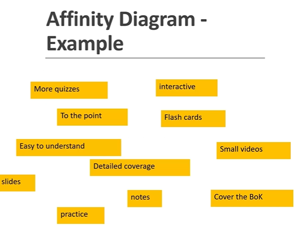
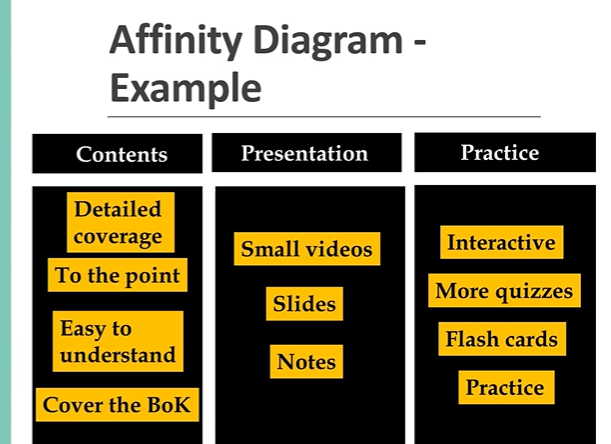
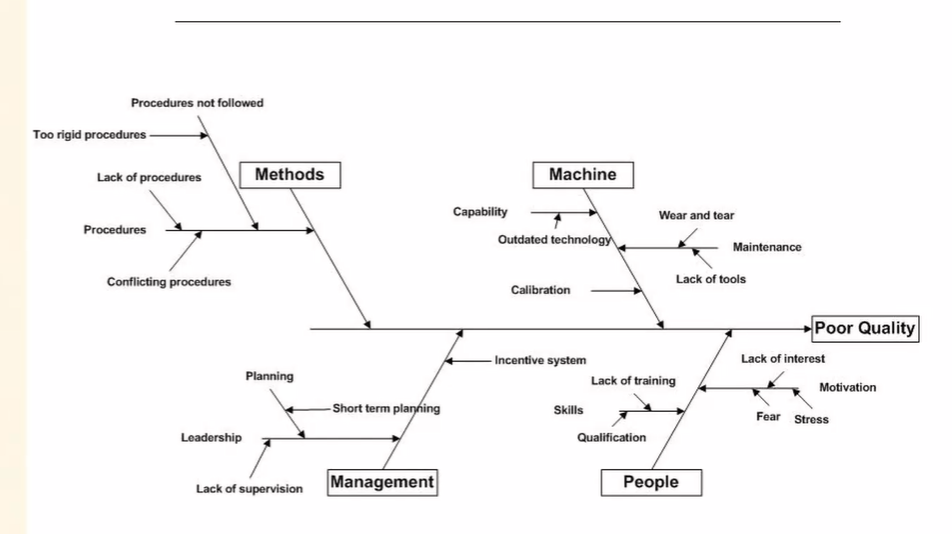
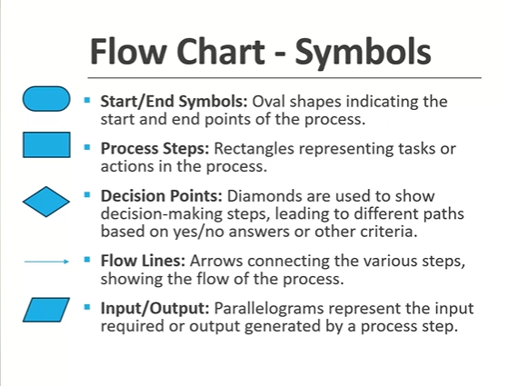
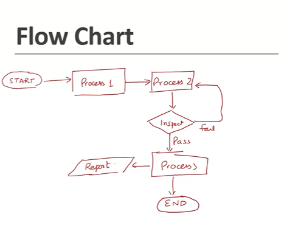

# 4n Artifacts

> Artifacts are basically templates to a document to output or to a deliverable.
> So basically they are record or they are the templates which we use on the project in artifacts.

## 4o Artifacts - Risk Register

```txt
Now let's start with the first artifact in the list, which is Risk Register.
Now, as a project quality manager on some projects, you might also be a risk manager.
Or maybe there's a possibility that someone else is a risk management representative.

Whatever case it is, let's remember that that the quality and risks are connected together.

Because as a quality manager, your role will be to minimize those risks which would affect the quality
of the project.

So there is a relationship between quality and risk management.
```

### Introduction to Risk Register

* **Definition**: A Risk Register is a project
management tool used for identifying,
documenting, and addressing potential risks in
a project.
* **Purpose**: To provide a comprehensive list of
risks with their respective impact and
mitigation strategies.
* **Importance**: Essential for proactive risk
management, helping in planning for
uncertainties and minimizing negative project
impacts.

```txt
Now what does risk register do is it gives you a comprehensive list of risks.
So it lists down all the risks which are possible on the project with their potential impact.
And it also includes what are the mitigation strategies which would be taken on the project.
So that way it will help you in reducing the chance of that risk happening on the project.
And also if the risk happens, it will reduce or the minimize the impact of that.
That's what mitigation is reducing the chance and reducing the impact of that.
```

```txt
Now what are the components of a typical risk register?
A typical risk register will have a list of all the risks which are possible, let's say in regards
to supplier, the risk is that the supplier might become bankrupt, supplier might supply the wrong

material, supplier might delay the project and so on.
So these are the potential risks which could happen on the project.
```

### Components of Risk Register

* **Risk Description:** A clear description of each potential risk.
* **Risk Category:** Risk classification (e.g., operational,
financial, legal).
* **Impact Level:** Assessment of the potential impact on the
project (high, medium, low).
* **Likelihood:** Probability of the risk occurring.
* **Mitigation Strategies:** Plans or actions to minimize the
impact or likelihood of the risk.
* **Owner:** The person or team responsible for monitoring and
managing the risk.
* **Status:** Current risk status (e.g., identified, in progress,
resolved).

### Benefits of Using a Risk Register

* **Enhanced Preparedness:** Helps the project team
prepare for and mitigate potential problems.
* **Improved Decision Making:** Provides a structured
approach to analyzing and responding to risks.
* **Increased Stakeholder Confidence:** Demonstrates a
proactive approach to risk management.
* **Documentation for Future Projects:** Serves as a
valuable reference for future project planning and
risk management.

## 4p Artifacts - Project Quality Management Plan

```txt
Now coming to the next artifact, which comes under the planning part.
Planning artifacts, which is the quality management plan.

There are so many other plans here as a part of artifacts.
As you could see, the change control plan, the cost management plan, the procurement management plan,

and so on, what you would be interested as a project quality manager would be the quality management
plan.
```

### Introduction to Quality Management Plan

* **Definition**: A Project Quality Plan is a
document that outlines the quality standards,
objectives, and criteria for a project.
* **Purpose:** To ensure the project meets its
defined quality benchmarks and stakeholder
expectations.
* **Scope:** Encompasses quality control, quality
assurance, and continuous improvement
processes throughout the project lifecycle.

### Key Components of a Project Quality Plan

* **Quality Objectives:** Specific goals that define what
constitutes quality for the project.
* **Quality Standards:** Industry or organizational
standards that the project must adhere to.
* **Roles and Responsibilities:** Defines who is responsible
for various quality management tasks.
* **Quality Control Activities:** Specific activities and
processes to monitor and control the quality of project
outputs.
* **Quality Assurance Processes:** Steps to ensure quality is
being built into project processes.
* **Tools and Techniques:** The methodologies and tools
used for ensuring quality.

```txt
Depending on the industry, you would have different components in your project quality management plan.
Now you might have a project quality plan for a health care project, or for a software development
or for a refinery.

These quality plans might look different in the form of contents in this plan, but the general idea is same
```

```txt
In addition to that, the project quality plan will have the QA activities as well, and quality assurance
activities typically would include monitoring the KPIs, the quality performance indicators, doing
some type of audits on the project, having the audit plan, all those type of activities would also
be addressed in the project quality plan.
Once again, the content of this plan will depend on your industry.
```

## 4q Artifacts - Inspection and Test Plan

### ITP - Introduction

* **Definition**: An Inspection and Test Plan (ITP) is a
comprehensive document detailing the inspection
and testing requirements for specific project
components or phases.
* **Purpose**: Ensures quality control throughout the
project by specifying how, when, and by whom
inspections and tests will be performed.
* **Key Components:** Scope of work, reference
documents, inspection and test activities,
acceptance criteria, responsible parties, and
documentation requirements.

```txt
So test plan in case of a software industry, would be quite different from a typical inspection and
test plan used in the construction industry.

Since my experience is mostly in the construction industry.

So let's talk about ITP, which is the inspection and test plan, which is a typical term used in the
construction industry.
```
### Involvement of Parties

* **Review Points:**
  * Definition: Stages in the project where documentation or work processes are
reviewed to ensure compliance with standards and specifications.
  * Application: Includes reviewing design documents, quality plans, or specific
procedures.

* **Witness Points:**
  * Definition: Specific points in the project where a client or their representative is
invited to observe a test or inspection.
  * Purpose: To assure that work is being carried out as per the agreed standards and
procedures.
  * Process: Notification is given in advance to allow for scheduling of the witness.

* **Hold Points:**
  * Definition: Critical points in the project workflow where work must not proceed
until an inspection or test has been completed and approved.
  * Significance: Ensures that critical quality checks are performed and approved
before moving to the next phase of work.
  * Management: Strict adherence to hold points is essential, and relevant authorities
must document and approve deviations.

```txt
Software industry might not have this type of structure, which I have discussed here in the form of
ITP or the inspection and test plan.
So their inspection and test plan could be different.
So each industry would have a different way of dealing with the test plan.

But the intent is same.

It lists down all the tests and inspections which will be done as a part of quality control on the project.
```

## 4r Artifacts - Affinity Diagram

### Introduction to Affinity Diagram

* **Definition**: An Affinity Diagram is a tool to
organize large amounts of data into related
groups based on their natural relationships.
* **Purpose**: Helps synthesize large volumes of
data by finding patterns and themes,
particularly useful in brainstorming sessions.
* **Application**: Commonly used in project
management, business analysis, and quality
improvement processes.

```txt
And now where from this data is coming, in most of the cases the data comes from a brainstorming session.
So let's say if you are doing a brainstorming on any problem on the project.
Supplier has delayed supplies, or there are defects or the welding defects are high.

Or maybe there are some software issues.
Whatever problem, you have to solve that problem, one thing which you might be doing is doing a brainstorming
```

### Creating an Affinity Diagram

* **Step 1: Data Collection:** Gather a broad range of
ideas or issues from project team members,
usually through brainstorming.
* **Step 2: Record Ideas:** Write each idea or issue on a
sticky note or card.
* **Step 3: Group Similar Ideas**: Allow team members
to silently organize the notes into related groups
on a large surface.
* **Step 4: Create Group Headers:** Once ideas are
grouped, discuss and agree on a header or title for
each group that captures the essence of its
content.

### Affinity Diagram Example



```txt
Let's look at an example.
For example I'm creating online courses and I did a brainstorming session with my team that how can
we improve our courses.

So here are some of the ideas which came that we should add more quizzes.

We should be to the point it should be interactive.
We can add flash card and so on.
```

```txt
Now dealing with these ideas is sometimes difficult.
So what you want to do is you want to group them together so that you can deal with them as a group.
```



### Benefits of Using Affinity Diagram

* **Organizes Thoughts:** Helps in structuring and
categorizing large, complex sets of ideas for better
analysis.
* **Encourages Participation:** Involves all team
members, giving everyone a voice in the process.
* **Reveals Relationships:** Uncovers hidden patterns
and connections between ideas or issues.
* **Aids Decision Making:** Provides a clearer
understanding of a complex issue, facilitating more
informed decision-making.

## 4s Artifacts - Cause and Effect Diagram

### Introduction to Cause and Effect Diagram

* **Definition**: A Cause and Effect Diagram, also
known as a Fishbone Diagram or Ishikawa
Diagram, is a visual tool used for identifying
and organizing possible causes of a problem.
* **Purpose**: To systematically explore and depict
all potential or real causes of a problem to
identify root causes.
* **Application**: Widely used in problem-solving
processes, particularly in quality management
and process improvement.


```txt
It is also called as fishbone diagram because the shape of this diagram looks like fish bones.
And this is also called as Ishikawa diagram because the quality Guru Ishikawa is considered to be the
originator of this particular diagram
```

```txt
The cause and effect diagram is a key diagram for doing the root cause analysis.
So if you are doing a root cause analysis of a problem, then there is a good chance that you will be

using this particular diagram, which is the cause and effect diagram, to understand what are the causes
and sub causes of a problem.
```

### How to Create a Cause and Effect Diagram

* **Step 1: Identify the Problem:** Clearly state the
problem at the head of the diagram.
* **Step 2: Determine Major Categories:** Decide on
broad categories for potential causes (**common
categories include Methods, Machines, Materials,
People, Measurements, and Environment**).
* **Step 3: Brainstorm Causes:** Engage the team in
identifying specific factors that might contribute
to the problem, placing these under the
appropriate categories.
* **Step 4: Analyze the Diagram:** Look for patterns or
areas with a high concentration of causes, which
can indicate key areas for further investigation.



```txt
Now this is the head.
Your problem statement goes in the head of the fish.
So here in this particular example poor quality is my problem.
```

```txt
So this particular fishbone diagram is just for the demonstration purpose.
But instead of writing poor quality, here you will be writing the specific problem which you are dealing
with.

And then you consider the main factors.
So in this particular example we consider the four main factors machine method management and people.
```

```txt
And then as a part of brainstorming we came out with number of causes and sub causes.
So when we were talking about machine somebody said that machine calibration could be a problem that
might have led to poor quality.
Somebody said that the capability of the machine might be the problem, and then the sub cause of capability
will be the outdated technology and so on.
```

### Benefits and Best Practices

* Benefits:
  * Encourages thorough analysis of problems.
  * Fosters teamwork and collective knowledge sharing.
  * Visual format makes it easy to understand complex
issues.

* Best Practices:
  * Involve team members from different areas of
expertise.
  * Keep the session focused and time-bound.
  * Use the diagram as a starting point for deeper
analysis, not an end in itself.

```txt
And whatever diagram you create that is basically just the beginning.
It is not an end in itself.
This is not something which is the final thing.
This is just a starting point to create discussion and evaluate that what all potential causes could
have contributed to the problem.
So this was a fishbone diagram or the cause and effect diagram or the Ishikawa diagram.
```

## 4t Artifacts - Flow chart

### Flow Chart - Introduction

* **Definition**: A Flow Chart is a graphical
representation of a process, illustrating the
sequence of steps from start to finish.
* **Purpose**: To provide a clear and easy-to-
understand overview of a process, helping
identify inefficiencies and opportunities for
improvement.
* **Application**: Used in various fields, including
project management, software development,
and business process modelling.

```txt
In many organizations.
They have replaced their written procedures with the flow chart.

So instead of giving a written procedure which says that we will be doing this, we will be doing that.
They have changed that to the flow chart because flow charts are easy to understand.

Personally, whenever I have to deal with a new process, my preference would be to draw a quick sketch
of the flow chart that how those things are being performed, especially when I'm doing audit,
```





> There are various tools which can make a nice presentable flow charts.
> But in most of the cases a handwritten one should be good enough.

### Benefits and Best Practices

* Benefits:
  * Enhances understanding of complex processes.
  * Aids in identifying bottlenecks and redundant steps.
  * Facilitates communication and documentation of
processes.

* Best Practices:
  * Keep the design simple and easy to follow.
  * Use consistent symbols and terminology.
  * Involve team members who are part of the process in creating and reviewing the flow chart.

## 4u Artifacts - Histogram

### Introduction to Histogram

* Definition: A Histogram is a type of bar chart
that represents the distribution of numerical
data.
* Purpose: To visually summarize the frequency
distribution of a data set, showing the
number of data points that fall within a range
of values (bins).
* Application: Commonly used in quality
management, statistics, and data analysis to
identify patterns or trends in data.

